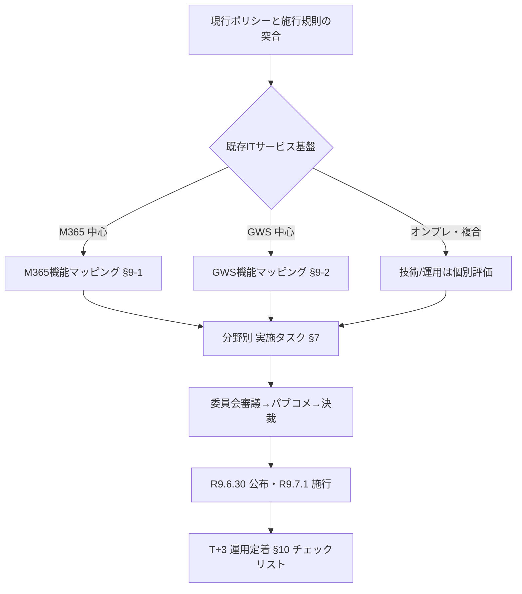

# 教育委員会向け 実施プロセス手引き（Microsoft 365／Google Workspace 例示版）

<!-- METADATA:UNIFIED -->
| 項目 | 内容 |
| --- | --- |
| 作成日 | 令和8年7月21日 |
| 作成者 | 中田寿穂 |
| 更新日 | 令和8年7月21日 |
| 更新者 | 中田寿穂 |
| バージョン | v1.0 |

---

## 本書の位置付け

本書は `implementation-process-for-boe.md`（ベンダー中立版）と **完全に同じ構造** を保ちつつ、教育委員会で実装イメージを掴めるように **Microsoft 365 Education（以下 M365）** と **Google Workspace for Education（以下 GWS）** の 2 系統を **中立的に併記** した参考版である。

- **想定読者**：教育委員会の情報担当課長・情報主任・システム所管
- **対象範囲**：中立版と同一（第1部＝R9.7.1 規程既存化対応／第2部＝既存セキュリティリスク全体の見直し）
- **例示方針**：
  - M365 と GWS を **必ず併記** し、どちらか一方に誘導しない
  - 挙げる機能はいずれも一般公開情報の範囲にとどめる
  - 具体的な設定手順・ライセンス比較は本書の対象外（別途 `sales-play-guide/` 参照）

> [!IMPORTANT]
> 本書での製品名列挙は **例示** であり、教育委員会が特定製品を採用することを推奨する趣旨ではない。中立性を保つ責任は運用側にある。

> [!NOTE]
> 中立版の目次・章立てと **1:1 で対応** している。ベンダー例示が不要な章は中立版と同一のため、本書では要約と参照のみを示している。

---

## 目次

1. [法令要求の全体像](#1-法令要求の全体像)
2. [実施プロセスの全体フロー](#2-実施プロセスの全体フロー)
3. [逆算スケジュール（ガント）](#3-逆算スケジュールガント)
4. [8分野×3ステージ MECE マトリクス](#4-8分野3ステージ-mece-マトリクス)
5. [第1部：規程既存化対応（R9.7.1 必達）](#5-第1部規程既存化対応r971-必達)
6. [第2部：既存セキュリティリスクの全体見直し](#6-第2部既存セキュリティリスクの全体見直し)
7. [8分野別 実施プロセス詳細（M365／GWS 例示）](#7-8分野別-実施プロセス詳細m365gws-例示)
8. [実施体制と役割分担（RACI）](#8-実施体制と役割分担raci)
9. [ベンダー機能マッピング（M365／GWS 一覧）](#9-ベンダー機能マッピングm365gws-一覧)
10. [チェックリスト（統合版）](#10-チェックリスト統合版)
11. [参考資料](#11-参考資料)

---

## 1. 法令要求の全体像

中立版 §1 と同一。要点のみ再掲。

| 法令・告示 | 施行日 | 概要 |
| --- | --- | --- |
| 令和6年法律第65号 | 令和6年9月26日公布 | 地方自治法第244条の5・第244条の6 新設 |
| 令和8年総務省令第80号 | **令和9年7月1日** | 施行規則第16条の3、8分野の対策事項 |
| 文科省 GL | R7.3 版現行／R9.3 改訂想定 | 教育情報セキュリティポリシー |

施行規則第16条の3 の 8分野（本書略称）：**組織／分類／物理／人的／技術／運用／委託／評価**

---

## 2. 実施プロセスの全体フロー

中立版 §2 の全体フローと同一。以下は本書独自の **クラウドサービス採用判断分岐** を追加したものである。

---

## 3. 逆算スケジュール（ガント）

中立版 §3 と同一。SaaS 中心構成の場合の追加観点のみ以下に示す。

| 追加観点 | M365 の場合 | GWS の場合 |
| --- | --- | --- |
| 設定変更の反映時間 | Entra ID 条件付きアクセス反映：数分〜数十分 | Admin コンソール反映：数分〜数十分 |
| 監査ログ取得開始のリードタイム | Purview／Defender 設定完了から蓄積開始 | Admin 監査ログ／セキュリティセンター有効化から蓄積 |
| バックアップの追加検討 | 標準保持期間の範囲外は 3rd party 検討 | Vault の保持期間設定・退職者データ扱い |

これらは施行日（R9.7.1）以降の運用定着期間（T+3ヶ月）に評価対象となるため、**R9.3〜R9.6 のうちに稼働開始・ログ蓄積を始める** ことが望ましい。

---

## 4. 8分野×3ステージ MECE マトリクス

中立版 §4 と同一。M365／GWS の主要機能を **技術／運用** 分野に集中して差し込むと、他分野は規程・人的対応が中心となる構造。

| 分野 | M365 主対応機能（例） | GWS 主対応機能（例） |
| --- | --- | --- |
| 組織 | 規程で規定 | 規程で規定 |
| 分類 | Purview Information Protection ラベル | Data classification（ラベル） |
| 物理 | 規程で規定（クラウドはベンダー責任分界） | 同左 |
| 人的 | 規程で規定＋Learning／Viva 等で補完 | 規程で規定＋Google Skillshop 等で補完 |
| 技術 | Entra ID／Defender／Intune／Purview | Endpoint／Context-Aware Access／Vault |
| 運用 | Defender／Sentinel／Purview Audit | Security Center／Alert Center／監査ログ |
| 委託 | 責任分界表・Microsoft Trust Center 参照 | 責任分界表・Google Cloud 契約参照 |
| 評価 | Compliance Manager／Secure Score | Security Health／Reports |

> [!TIP]
> **クラウド責任共有モデル** の理解が必須。物理・一部運用はベンダー責任、それ以外は教育委員会責任として明示的に線を引く。

---

## 5. 第1部：規程既存化対応（R9.7.1 必達）

中立版 §5 と同一プロセス。クラウド利用時の追加条項として以下を規程に含める。

- クラウドサービスの利用範囲・データ所在地の明示
- 責任共有モデル（教育委員会側／ベンダー側の分界）の明示
- インシデント時のベンダー通知経路と SLA
- 監査権行使の方法（第三者監査報告書の受領・レビュー等）
- 退職者・卒業者データの取扱期限

---

## 6. 第2部：既存セキュリティリスクの全体見直し

中立版 §6 と同一。クラウド利用時の重点観点は次のとおり。

| リスク項目 | M365 での確認点 | GWS での確認点 |
| --- | --- | --- |
| MFA | Entra ID セキュリティ既定値／条件付きアクセス | 2 段階認証プロセス（強制） |
| デバイス管理 | Intune で MDM／MAM | Endpoint management（Basic／Advanced） |
| データ持出制御 | Purview DLP／Endpoint DLP | DLP for Drive／Gmail |
| ネットワーク境界 | Defender for Cloud Apps／Global Secure Access | Context-Aware Access |
| バックアップ | 標準保持＋必要に応じ 3rd party | Vault の保持ポリシー |
| ログ保全 | Purview Audit（Standard／Premium） | 監査ログ／セキュリティセンター |
| インシデント通知 | Microsoft Trust Center／Message Center | Google Workspace Status Dashboard／通知 |

---

## 7. 8分野別 実施プロセス詳細（M365／GWS 例示）

各分野のフロー・主要タスク・落とし穴は中立版 §7 と同一。本節は **M365／GWS の実装例のみ** を追加する。

### 7.1 組織（第1号）

例示なし（規程・人的対応が中心）。中立版 §7.1 参照。

### 7.2 分類（第2号）

| ステップ | M365 実装例 | GWS 実装例 |
| --- | --- | --- |
| 分類ラベル定義 | Purview の Sensitivity Labels | Drive のラベル（Beta 含む） |
| 全資産ラベル付与 | 自動ラベル付けポリシー | 自動分類ポリシー |
| 適用範囲 | Word/Excel/PowerPoint/Outlook/Teams | Docs/Sheets/Slides/Gmail/Drive |

**注意**：ラベルは **規程との整合** が必須。規程で 3 段階なら製品側も 3 段階に揃える。

### 7.3 物理（第3号）

クラウドサービス部分はベンダー責任（**Microsoft Trust Center** ／ **Google Cloud のコンプライアンス報告書**）。教育委員会側は自庁舎・端末・記録媒体の物理対策に集中する。

### 7.4 人的（第4号）

| ステップ | M365 実装例 | GWS 実装例 |
| --- | --- | --- |
| 教育コンテンツ配布 | Viva Learning／SharePoint | Classroom／Sites |
| 受講記録 | Viva Learning／M365 レポート | Classroom 成績／Looker Studio |
| フィッシング演習 | Attack Simulation Training（Defender for Office 365） | 3rd party（Google 標準未提供） |

### 7.5 技術（第5号）

| 観点 | M365 実装例 | GWS 実装例 |
| --- | --- | --- |
| ID・MFA | Entra ID＋条件付きアクセス | 2SV（2 段階認証プロセス） |
| 特権管理 | Privileged Identity Management（PIM） | Super Admin 分離＋監査 |
| 端末管理 | Intune（MDM／MAM） | Endpoint management |
| 暗号化 | 保存時：BitLocker／Purview／通信時：TLS | 保存時：Google 管理鍵／CMEK／通信時：TLS |
| 境界防御 | Defender for Cloud Apps／Global Secure Access | Context-Aware Access |
| 脆弱性管理 | Defender for Endpoint／Vulnerability Management | Chrome／ChromeOS 脆弱性通知＋端末更新 |

### 7.6 運用（第6号）

| 観点 | M365 実装例 | GWS 実装例 |
| --- | --- | --- |
| 監査ログ | Purview Audit（Standard／Premium） | 監査ログ（Admin／Login／Drive など） |
| SIEM 連携 | Microsoft Sentinel | Chronicle／SIEM API 連携 |
| インシデント検知 | Defender XDR | Alert Center／Security Center |
| バックアップ | 標準保持＋3rd party | Vault |
| 変更管理 | Change Analytics（Azure）／Purview | Admin コンソール変更ログ |

**チェックポイント**：ログの **保全期間** が規程要求と整合していること（例：規程で 1 年なら製品側も 1 年以上）。

### 7.7 委託（第7号）

| 観点 | M365 実装例 | GWS 実装例 |
| --- | --- | --- |
| ベンダー責任分界 | Microsoft Trust Center／Service Trust Portal | Google Cloud 責任共有モデル |
| 第三者監査報告 | SOC 2／ISO 27001／ISMAP 等 | SOC 2／ISO 27001／ISMAP 等 |
| 再委託の可視化 | Data location／サブプロセッサ一覧 | サブプロセッサ一覧 |
| インシデント通知 | Message Center／Trust Center 通知 | Status Dashboard／管理者通知 |

### 7.8 評価（第8号）

| 成果物 | M365 実装例 | GWS 実装例 |
| --- | --- | --- |
| 監査 | Compliance Manager | Security Health |
| 自己点検 | Secure Score | Security Health＋Reports |
| 改善決定 | Compliance Manager アクション | Security Health 推奨アクション |
| 見直し記録 | 委員会議事録＋Compliance Manager 履歴 | 委員会議事録＋Reports 履歴 |

**注意**：4 成果物（監査・自己点検・改善決定・見直し）はいずれも **同一年度内** に揃わないと評価分野は不合格判定となる。

---

## 8. 実施体制と役割分担（RACI）

中立版 §8 と同一。クラウド運用固有の追加役割として以下を設けることを推奨する。

| 追加役割 | 責務 | 兼務可否 |
| --- | --- | --- |
| クラウド管理者（M365／GWS Admin） | テナント設定・ライセンス・監査ログ運用 | 情報主任と兼務可 |
| ID 管理者 | ユーザー・グループ・特権 | クラウド管理者と分離推奨 |
| ログレビュア | 監査ログの週次・月次レビュー | 内部監査担当と分離推奨 |

---

## 9. ベンダー機能マッピング（M365／GWS 一覧）

### 9.1 M365 側 主要機能と対応分野

| 機能 | 主対応分野 | 副次対応分野 |
| --- | --- | --- |
| Entra ID（旧 Azure AD） | 技術 | 組織（役割） |
| 条件付きアクセス | 技術 | 運用 |
| Intune | 技術 | 運用 |
| Purview Information Protection | 分類 | 技術 |
| Purview DLP | 技術 | 運用 |
| Purview Audit | 運用 | 評価 |
| Defender for Endpoint | 技術 | 運用 |
| Defender for Office 365 | 技術 | 人的（訓練） |
| Defender for Cloud Apps | 技術 | 運用 |
| Microsoft Sentinel | 運用 | 評価 |
| Compliance Manager | 評価 | 委託（第三者監査） |
| Secure Score | 評価 | 運用 |

### 9.2 GWS 側 主要機能と対応分野

| 機能 | 主対応分野 | 副次対応分野 |
| --- | --- | --- |
| 2 段階認証プロセス | 技術 | 組織 |
| Context-Aware Access | 技術 | 運用 |
| Endpoint management | 技術 | 運用 |
| Drive ラベル | 分類 | 技術 |
| DLP for Drive／Gmail | 技術 | 運用 |
| 監査ログ／Admin レポート | 運用 | 評価 |
| Alert Center | 運用 | 技術 |
| Security Center／Security Health | 評価 | 運用 |
| Vault | 運用 | 評価 |
| Chronicle 連携 | 運用 | 評価 |
| Reports API | 評価 | 運用 |

### 9.3 分野別 M365／GWS 対応早見表

| 分野 | M365 で満たす主な機能 | GWS で満たす主な機能 | 規程・人的側の補完 |
| --- | --- | --- | --- |
| 組織 | ロール定義 | ロール定義 | 規程 |
| 分類 | Purview ラベル | Drive ラベル | 規程・台帳 |
| 物理 | ベンダー責任 | ベンダー責任 | 自庁舎・端末 |
| 人的 | Viva Learning／ASF | Classroom | 誓約・研修規程 |
| 技術 | Entra／Defender／Intune／Purview | 2SV／CAA／Endpoint／DLP | 鍵管理・運用手順 |
| 運用 | Purview Audit／Sentinel | 監査ログ／Chronicle | IR 手順 |
| 委託 | Trust Center | Cloud 責任共有 | 契約雛形 |
| 評価 | Compliance Manager／Secure Score | Security Health／Reports | 監査規程・議事録 |

---

## 10. チェックリスト（統合版）

中立版 §9 のチェックリストに、以下 **クラウド固有 8 項目** を追加する。

- [ ] 管理者アカウントの MFA／2SV 実装率 100%
- [ ] 条件付きアクセス／Context-Aware Access のポリシー本番適用
- [ ] MDM／Endpoint management 加入率が規程要求を満たす
- [ ] 分類ラベルが 全対象文書に自動付与されている
- [ ] 監査ログの保全期間が規程要求以上
- [ ] SIEM または同等サービスへのログ連携
- [ ] 第三者監査報告書の年次レビュー実施
- [ ] Compliance Manager／Security Health のスコアが目標値以上

> [!TIP]
> 中立版 §9 の 24 項目（8×3）と本書のクラウド固有 8 項目、合計 **32 項目** を最終確認する。

---

## 11. 参考資料

- 中立版 `implementation-process-for-boe.md`（本書の対応版）
- Microsoft「Microsoft Trust Center」「Service Trust Portal」
- Google「Google Cloud 責任共有モデル」「Google Workspace 管理者ヘルプ」
- 総務省「地方公共団体における情報セキュリティポリシーに関するガイドライン」（令和7年3月）
- 文部科学省「教育情報セキュリティポリシーに関するガイドライン」（令和7年3月）
- 本リポジトリ `research/sources/` 配下の一次資料
- 本リポジトリ `proposal/revision-proposal.md`（改訂案本体）
- 参考文献の詳細は `references.md` を参照

> [!IMPORTANT]
> 本書は M365／GWS の一般公開情報に基づく **例示** である。個別テナントの機能可用性・ライセンス条件は変動するため、採用検討時はベンダー公式ドキュメントで最新情報を確認すること。

---

## 改訂履歴

| バージョン | 日付 | 更新者 | 変更内容 |
| --- | --- | --- | --- |
| v1.0 | 令和8年7月21日 | 中田寿穂 | 初版作成（M365／GWS 例示版） |
