# 教育委員会向け 実施プロセス手引き（ベンダー中立版）

<!-- METADATA:UNIFIED -->
| 項目 | 内容 |
| --- | --- |
| 作成日 | 令和8年7月21日 |
| 作成者 | 中田寿穂 |
| 更新日 | 令和8年7月21日 |
| 更新者 | 中田寿穂 |
| バージョン | v1.0 |

---

## 本書の位置付け

本書は、`proposal/revision-proposal.md`（文部科学省「教育情報セキュリティポリシーに関するガイドライン」改訂案）の **付属資料** として、全国の教育委員会（都道府県・市区町村を問わず）が、令和8年総務省令第80号（地方自治法施行規則第16条の3、**令和9年7月1日施行**）に準拠するために必要な実施プロセスを、抜け漏れなく（MECE）進められるように整理したものである。

- **想定読者**：教育委員会の情報担当課長・情報主任・セキュリティ主管
- **対象範囲**：
  1. **第1部**：令和9年7月1日までに完了すべき「規程の既存化」対応
  2. **第2部**：この機会に併せて実施すべき既存セキュリティリスク全体の見直し
- **MECE 軸**：施行規則第16条の3 の **8分野**（第1〜8号）× 実施フェーズ **3ステージ**（規程整備・運用実装・評価改善）
- **可視化**：Mermaid フローチャート／ガント／マトリクスを Markdown に直接埋め込み（GitHub 上でそのまま描画）
- **本書はベンダー中立**：具体製品名を挙げない。実装例が必要な場合は `implementation-process-for-boe-with-examples.md` を併読すること

> [!IMPORTANT]
> 令和9年7月1日は施行日である。施行日時点で **規程が存在し、運用が開始されていること** が求められる。逆算スケジュール（後述 §3）を必ず確認すること。

---

## 目次

1. [法令要求の全体像](#1-法令要求の全体像)
2. [実施プロセスの全体フロー](#2-実施プロセスの全体フロー)
3. [逆算スケジュール（ガント）](#3-逆算スケジュールガント)
4. [8分野×3ステージ MECE マトリクス](#4-8分野3ステージ-mece-マトリクス)
5. [第1部：規程既存化対応（R9.7.1 必達）](#5-第1部規程既存化対応r971-必達)
6. [第2部：既存セキュリティリスクの全体見直し](#6-第2部既存セキュリティリスクの全体見直し)
7. [8分野別 実施プロセス詳細](#7-8分野別-実施プロセス詳細)
8. [実施体制と役割分担（RACI）](#8-実施体制と役割分担raci)
9. [チェックリスト（統合版）](#9-チェックリスト統合版)
10. [参考資料](#10-参考資料)

---

## 1. 法令要求の全体像

### 1.1 上位法令

| 法令・告示 | 施行日 | 教育委員会への直接効果 |
| --- | --- | --- |
| 令和6年法律第65号（地方自治法改正） | 令和6年9月26日公布 | 第244条の5・第244条の6 新設。特定情報システムの基準適合義務・報告義務 |
| 令和8年総務省令第80号（施行規則第16条の3） | **令和9年7月1日** | 8分野の対策事項を規程で定めるべきことを規定 |
| 文部科学省「教育情報セキュリティポリシーに関するガイドライン」 | 令和7年3月版（現行） | 令和9年3月改訂想定（当社想定・未公表） |

### 1.2 施行規則第16条の3 の 8分野

| 号 | 分野名（本書略称） | 主な対策事項 |
| --- | --- | --- |
| 第1号 | **組織** | 責任体制、権限、意思決定プロセス |
| 第2号 | **分類** | 情報資産の分類・重要度判定・取扱区分 |
| 第3号 | **物理** | 物理的アクセス制御、設備保護、廃棄手順 |
| 第4号 | **人的** | 職員教育、誓約書、退職時対応、委託時教育 |
| 第5号 | **技術** | 認証、アクセス制御、暗号、通信・端末保護 |
| 第6号 | **運用** | 監視、ログ、インシデント対応、変更管理、バックアップ |
| 第7号 | **委託** | 委託先の選定・監督、契約、再委託管理 |
| 第8号 | **評価** | 監査、自己点検、改善措置、見直し（PDCA） |

> [!NOTE]
> 本書全体を通じて、8分野は上記略称（組織／分類／物理／人的／技術／運用／委託／評価）で参照する。

---

## 2. 実施プロセスの全体フロー

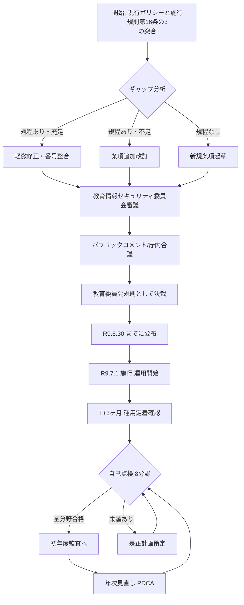

**フローの読み方**

- 開始点は「現行ポリシーと施行規則第16条の3 の突合」。多くの教育委員会は現行 CISO・情報セキュリティポリシーが存在するため、ゼロベースではなく **差分改訂** となる
- 判断ノード `B` で分野・条項ごとに 3 通りに分岐する
- `G`（R9.6.30 公布）と `H`（R9.7.1 施行）は法定期限。逆算する
- `I`（T+3ヶ月）以降は本書の **評価分野（第8号）** に沿って PDCA を回す

---

## 3. 逆算スケジュール（ガント）

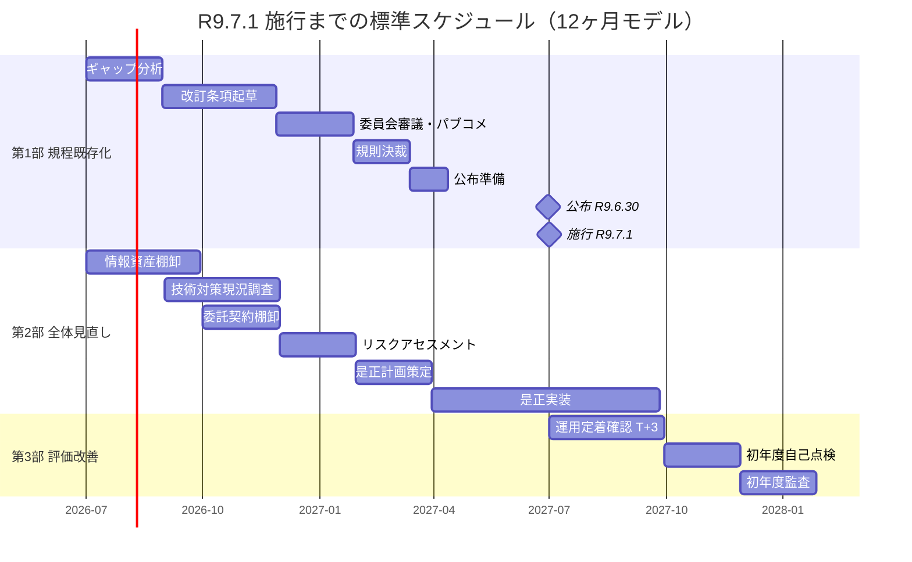

### 3.1 マイルストーンと逆算根拠

| マイルストーン | 期限 | 逆算根拠 |
| --- | --- | --- |
| 規則決裁完了 | R9.5 末 | 公布準備1ヶ月＋バッファ確保 |
| パブコメ完了 | R9.3 末 | 決裁前に外部意見反映が必要 |
| 起草完了 | R9.1 末 | パブコメ2ヶ月前 |
| ギャップ分析完了 | R8.8 末 | 起草着手前 |
| 委員会立ち上げ | R8.7 中 | 本書入手直後 |

> [!WARNING]
> **開始が R9.1 以降になる場合**、パブコメ期間短縮・審議回数削減で対応せざるを得ないケースがある。その場合でも施行日は不変であることに注意すること。

### 3.2 12ヶ月確保できない場合の短縮モデル

| 残期間 | 推奨アプローチ |
| --- | --- |
| 9〜12ヶ月 | 標準モデル（本書の推奨） |
| 6〜9ヶ月 | 現行ポリシーへの **追補（別冊）** 方式で最小改訂、施行後に本体統合 |
| 3〜6ヶ月 | **暫定規程** を教育長訓令で先行、規則本体は年度内継続改訂 |
| 3ヶ月未満 | 施行日までの暫定運用を委員会議事録で公式化し、遅滞なく規則化 |

---

## 4. 8分野×3ステージ MECE マトリクス

| 分野 \ ステージ | 規程整備（Plan） | 運用実装（Do） | 評価改善（Check・Act） |
| --- | --- | --- | --- |
| **組織** | 責任者・委員会の規程明記 | 役割の実運用開始・意思決定記録 | 体制の見直し・再任 |
| **分類** | 分類基準・取扱区分の規程化 | 全情報資産への分類ラベル付与 | 分類妥当性の年次見直し |
| **物理** | 物理区域・入退室・廃棄手順の規程化 | 施錠・入退室記録・廃棄実施 | 物理監査・是正 |
| **人的** | 教育計画・誓約書・退職時手順の規程化 | 全職員教育・誓約取得・退職処理 | 受講率・理解度評価 |
| **技術** | 認証・暗号・境界防御方針の規程化 | 設定実装・端末配布・鍵管理 | 技術監査・脆弱性再評価 |
| **運用** | 監視・ログ・IR・変更管理の規程化 | 監視運用・ログ保全・IR訓練 | インシデント傾向分析 |
| **委託** | 委託基準・契約雛形・監督手順の規程化 | 契約更改・監督実施 | 委託先評価・再選定 |
| **評価** | 監査・自己点検・見直しの規程化 | 監査計画実行・自己点検実施 | 経営層報告・PDCA 決裁 |

**MECE 確認観点**

- **Mutually Exclusive**：各分野は独立事象。ある対策は必ずいずれか 1 分野に主として帰属させる（例：MFA は「技術」、MFA 教育は「人的」）
- **Collectively Exhaustive**：本マトリクスの全 24 セル（8×3）に必ず 1 件以上の実施項目を持たせる。空セルがあればそれは抜け漏れ

---

## 5. 第1部：規程既存化対応（R9.7.1 必達）

### 5.1 目的

施行規則第16条の3 が定める 8分野の対策事項について、**教育委員会規則（またはそれに準ずる規程）** として R9.7.1 までに存在させる。

### 5.2 プロセスフロー

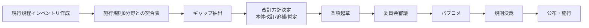

### 5.3 成果物

| # | 成果物 | 目的 | 期限目安 |
| --- | --- | --- | --- |
| 1 | 現行規程インベントリ表 | 既存資産の把握 | R8.8 |
| 2 | 施行規則8分野突合表 | ギャップ可視化 | R8.9 |
| 3 | 改訂方針書 | 委員会承認 | R8.10 |
| 4 | 改訂条項ドラフト | 起草成果 | R9.1 |
| 5 | パブコメ結果反映版 | 外部意見織込 | R9.4 |
| 6 | 規則決裁文書 | 公式化 | R9.5 |
| 7 | 施行版規則 | 施行 | R9.6.30 公布 |

### 5.4 判定基準（規程整備ステージ完了条件）

- 8分野すべてについて、対応する条項が **規則本文または別表** に存在すること
- 施行規則の号番号（第1号〜第8号）と規則条項の対応表が作成されていること
- 施行日（R9.7.1）時点で **公布済み** であること
- 施行日以降の運用開始に必要な様式・手順書がドラフト以上の状態で揃っていること

---

## 6. 第2部：既存セキュリティリスクの全体見直し

### 6.1 目的

規程既存化対応（第1部）と並行して、規程だけでは満たされない **実際のセキュリティリスク** をこの機会に棚卸し、必要な是正を計画する。

### 6.2 プロセスフロー

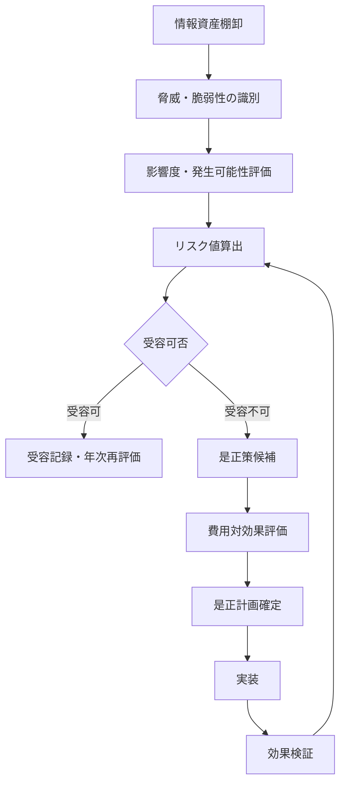

### 6.3 見直しの重点観点（例）

- **多要素認証（MFA）**：教職員・児童生徒アカウントの MFA 実装状況
- **端末管理**：MDM／EDR の導入範囲・パッチ適用率
- **ネットワーク分離**：校務系・学習系・外部接続の分離要件
- **バックアップ**：3-2-1 ルール、リストア試験の実施状況
- **委託先監督**：クラウドサービス選定基準、SLA、監査権
- **ログ保全**：認証・アクセス・変更のログ取得と保全期間
- **インシデント対応**：CSIRT／CERT の役割定義、訓練頻度

### 6.4 判定基準

- 情報資産台帳が最新化されている（分類ラベル付き）
- 各リスクに対する対応方針（回避・低減・移転・受容）が明示されている
- 是正計画に **担当・期限・完了基準** が付されている
- 受容リスクは委員会決裁を経ている

---

## 7. 8分野別 実施プロセス詳細

各分野で共通して以下の 4 情報を提示する。

- 実施プロセスフロー（Mermaid）
- 主要タスク一覧
- 完了判定チェックポイント
- 落とし穴（現場でよくある指摘事項）

### 7.1 組織（第1号）

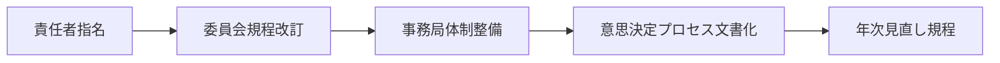

**主要タスク**

| # | タスク | 責任 | 完了判定 |
| --- | --- | --- | --- |
| 1 | 最高情報セキュリティ責任者（CISO 相当）の任命 | 教育長 | 発令通知 |
| 2 | 情報セキュリティ委員会規程の改訂 | 事務局 | 委員会決裁 |
| 3 | 事務局（情報担当課）の役割明記 | 情報担当課長 | 規則条項 |
| 4 | 教職員代表・保護者代表の参画枠 | 事務局 | 委員名簿 |
| 5 | 議事録の作成・保管ルール | 事務局 | 議事録テンプレ |

**チェックポイント**：委員会は年 **2回以上** 開催されていること／議事録に決裁事項が明記されていること

**落とし穴**：委員会が形骸化し年 1 回の書面決裁のみになっている／CISO が兼務で実質不在

### 7.2 分類（第2号）

**主要タスク**

| # | タスク | 責任 | 完了判定 |
| --- | --- | --- | --- |
| 1 | 分類区分（例：機密／要保護／一般）の定義 | 情報主任 | 規程条項 |
| 2 | 児童生徒個人情報の取扱区分明記 | 情報主任 | 別表 |
| 3 | 情報資産台帳の様式整備 | 情報主任 | 台帳雛形 |
| 4 | 全校・全課の資産洗出し | 各所属長 | 台帳提出 |
| 5 | 分類ラベルの付与ルール | 情報主任 | 運用手順 |

**チェックポイント**：児童生徒の氏名・成績・出欠等が **要保護** 以上に位置付けられていること

**落とし穴**：写真・動画・保護者連絡先の分類漏れ

### 7.3 物理（第3号）

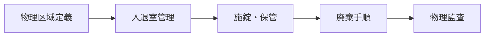

**主要タスク**：サーバ室・執務室・教室の区域分け／入退室記録の保存期間／HDD・USB の廃棄証明取得／持ち出し記録

**チェックポイント**：サーバ室入退室記録が **1年以上** 保存されていること／廃棄証明書が保管されていること

**落とし穴**：職員室内 PC の施錠忘れ／退職時 USB 回収漏れ

### 7.4 人的（第4号）

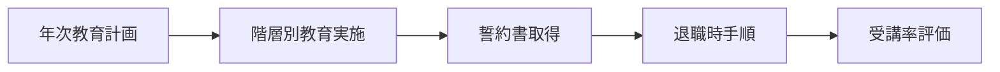

**主要タスク**：新任研修・年次研修・管理職研修の 3層設計／誓約書の書式・保管／退職・異動時のアカウント無効化手順

**チェックポイント**：全教職員の受講率 **95% 以上**／誓約書の未取得者ゼロ

**落とし穴**：会計年度任用職員・非常勤講師の教育漏れ

### 7.5 技術（第5号）

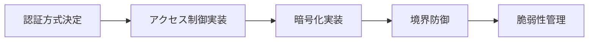

**主要タスク**：MFA 実装／最小権限原則／保存・通信の暗号化／端末管理（MDM／EDR）／脆弱性スキャン頻度

**チェックポイント**：管理者アカウントの **MFA 実装率 100%**／脆弱性スキャンが **月次以上** 実施

**落とし穴**：共有アカウントの残存／設定変更後の権限見直し漏れ

### 7.6 運用（第6号）

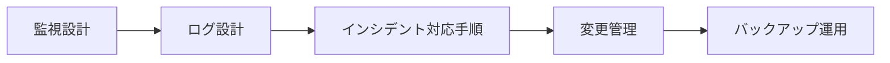

**主要タスク**：ログの取得対象・保全期間／インシデント発見〜報告〜復旧のフロー／変更管理台帳／バックアップの実施頻度とリストア試験

**チェックポイント**：認証・アクセス・変更ログの取得率 **100%**／リストア試験の年次実施

**落とし穴**：ログ保全期間が施行規則要求を下回る／リストア試験が机上のみ

### 7.7 委託（第7号）

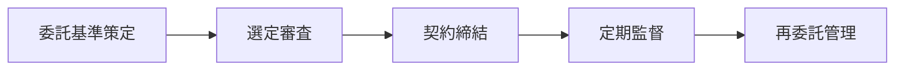

**主要タスク**：委託先選定チェックリスト／契約雛形（機密保持・監査権・再委託承認・事故通知）／年次監督報告

**チェックポイント**：全委託契約に施行規則対応条項が入っていること／再委託は書面承認済み

**落とし穴**：既存長期契約の未更新／SaaS 更改時の再審査漏れ

### 7.8 評価（第8号）

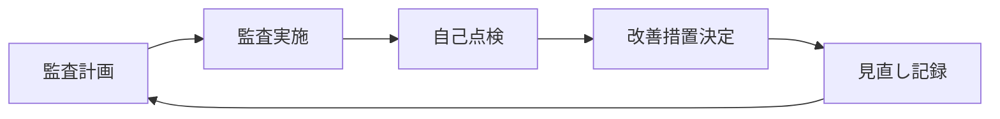

**主要タスク**：内部監査規程／外部監査要件／自己点検票／改善措置記録／年次見直し議事録

**チェックポイント**：**4 成果物**（監査記録・自己点検記録・改善決定・見直し記録）が **同一年度内** に揃っていること

**落とし穴**：自己点検はしているが改善決定と見直しが未記録／PDCA が回っていることの証跡不足

---

## 8. 実施体制と役割分担（RACI）

**凡例**：R=Responsible（実行）／A=Accountable（最終責任）／C=Consulted（相談）／I=Informed（報告）

| タスク \ 役割 | 教育長 | CISO （情報担当課長） | 情報主任 | 各所属長 | 事務局 | 外部委託先 |
| --- | --- | --- | --- | --- | --- | --- |
| 規程改訂の意思決定 | A | R | C | I | C | - |
| ギャップ分析 | I | A | R | C | R | C |
| 条項起草 | I | A | R | C | R | C |
| パブコメ運営 | I | A | C | I | R | - |
| 施行後の運用開始 | I | A | R | R | C | R |
| インシデント初動 | I | A | R | R | C | C |
| 年次自己点検 | I | A | R | R | C | I |
| 内部監査 | I | A | R | C | R | - |
| 委員会報告 | A | R | C | I | R | - |

### 8.1 兼務許容範囲

- CISO と情報担当課長は兼務可（多くの教育委員会で実態）
- 情報主任と事務局は分離が望ましい（自己点検の独立性確保）
- 外部委託先は監査・脆弱性診断で常用可、意思決定は不可

---

## 9. チェックリスト（統合版）

R9.7.1 直前の最終確認用に、以下 24 項目（8分野 × 3ステージ）を通しでチェックする。

### 9.1 規程整備ステージ（Plan）

- [ ] **組織**：委員会規程に責任体制・意思決定プロセスが明記されている
- [ ] **分類**：分類基準・取扱区分・情報資産台帳様式が規程化されている
- [ ] **物理**：物理区域・入退室・廃棄手順が規程化されている
- [ ] **人的**：教育計画・誓約書様式・退職時手順が規程化されている
- [ ] **技術**：認証・暗号・境界防御方針が規程化されている
- [ ] **運用**：監視・ログ・IR・変更管理・バックアップが規程化されている
- [ ] **委託**：委託基準・契約雛形・監督手順が規程化されている
- [ ] **評価**：監査・自己点検・見直しが規程化されている

### 9.2 運用実装ステージ（Do）

- [ ] **組織**：任命発令・委員会議事録が存在
- [ ] **分類**：全情報資産にラベル付与済
- [ ] **物理**：施錠・入退室記録・廃棄証明が実施記録として存在
- [ ] **人的**：全教職員に教育実施・誓約書取得済
- [ ] **技術**：MFA・暗号化・境界防御が本番稼働
- [ ] **運用**：監視稼働・ログ取得・IR 訓練実施
- [ ] **委託**：契約更改・監督報告受領
- [ ] **評価**：監査計画が承認済・自己点検票が発行済

### 9.3 評価改善ステージ（Check・Act）

- [ ] **組織**：委員会での見直し議事録
- [ ] **分類**：年次分類見直し記録
- [ ] **物理**：物理監査記録・是正記録
- [ ] **人的**：受講率・理解度評価記録
- [ ] **技術**：技術監査・脆弱性再評価記録
- [ ] **運用**：インシデント傾向分析報告
- [ ] **委託**：委託先評価・再選定判断記録
- [ ] **評価**：4成果物（監査・自己点検・改善決定・見直し）が同一年度内で揃う

> [!TIP]
> チェック項目に「未」が残る場合、`§7 分野別詳細` の該当節に戻り、タスクを分解して着手期日を再設定すること。

---

## 10. 参考資料

- 令和6年法律第65号（地方自治法の一部を改正する法律）
- 令和8年総務省令第80号（地方自治法施行規則の一部を改正する省令）
- 文部科学省「教育情報セキュリティポリシーに関するガイドライン」（令和7年3月）
- 総務省「地方公共団体における情報セキュリティポリシーに関するガイドライン」（令和7年3月）
- 本リポジトリ `research/sources/` 配下の一次資料
- 本リポジトリ `proposal/revision-proposal.md`（改訂案本体）
- 参考文献の詳細は `references.md` を参照

---

## 改訂履歴

| バージョン | 日付 | 更新者 | 変更内容 |
| --- | --- | --- | --- |
| v1.0 | 令和8年7月21日 | 中田寿穂 | 初版作成（ベンダー中立版） |
