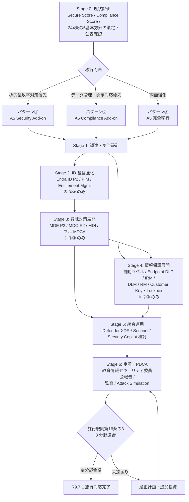
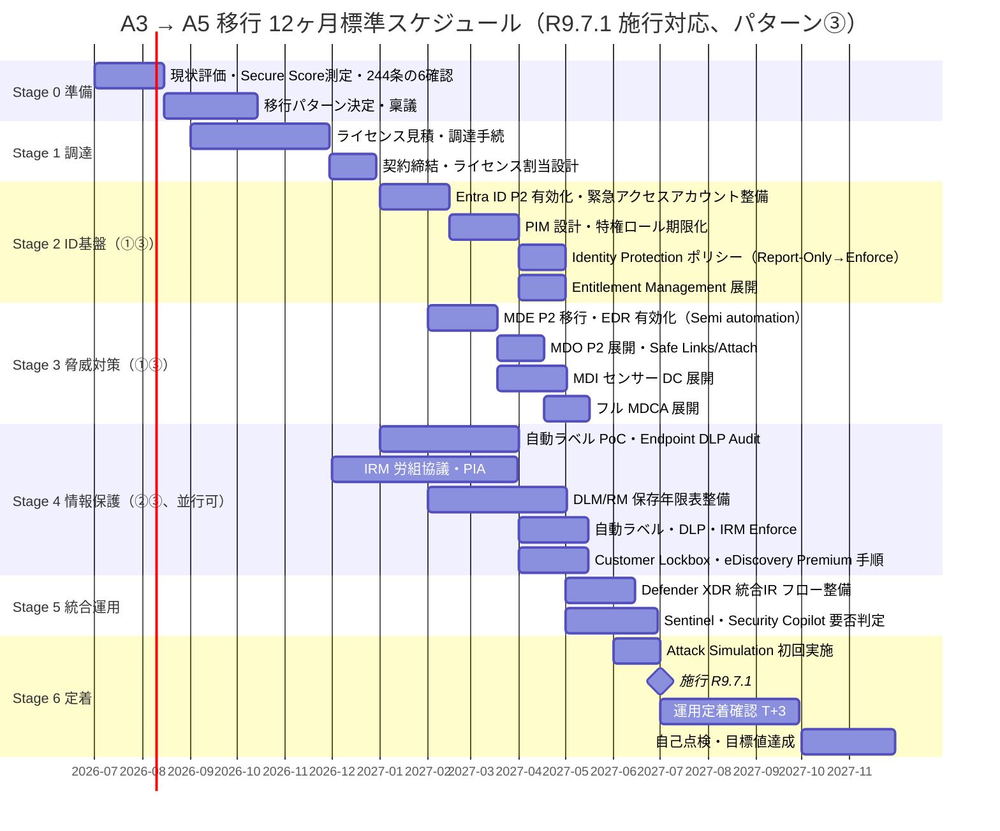

# 教育委員会向け Microsoft 365 A3 → A5 移行 実施プロセス手引き

<!-- METADATA:UNIFIED -->
| 項目 | 内容 |
| --- | --- |
| 作成日 | 令和8年7月22日 |
| 作成者 | 中田寿穂 |
| 更新日 | 令和8年7月22日 |
| 更新者 | 中田寿穂 |
| バージョン | v1.1 |

---

## 本書の位置付け

本書は、`proposal/revision-proposal.md`（文部科学省「教育情報セキュリティポリシーに関するガイドライン」改訂案）および `proposal/implementation-process-for-boe.md`（ベンダー中立版 実施プロセス手引き）の **付属資料** として、既に **Microsoft 365 A3（以下 A3）** を教職員に配備している教育委員会が、令和8年総務省令第80号（地方自治法施行規則第16条の3、**令和9年7月1日施行**）が求める措置水準を実装する手段の一つとして **Microsoft 365 A5（以下 A5）** へ移行する場合の、抜け漏れなく（MECE）進められる実施プロセスを整理したものである。

- **想定読者**：教育委員会の情報担当課長・情報主任・セキュリティ主管、CISO 補佐、および技術支援を行う Microsoft パートナー
- **対象範囲**：
  1. **第1部**：ライセンス切替と機能有効化までの技術移行プロセス
  2. **第2部**：施行規則第16条の3 の 8 分野に対する A5 の貢献と規程・運用への織込
  3. **第3部**：移行後の定着・PDCA 化
- **MECE 軸**：移行フェーズ **7 ステージ**（Stage 0 準備 → Stage 1 調達 → Stage 2 ID 基盤 → Stage 3 脅威対策 → Stage 4 情報保護 → Stage 5 統合運用 → Stage 6 定着）× 施行規則 **8 分野**（第1〜8号）
- **前提**：教職員全員に A3 が割り当てられ、Entra ID・Intune・Exchange Online・SharePoint Online・Teams・OneDrive の基本運用が既に稼働していること

> [!IMPORTANT]
> **A5 導入は法令上の必須要件ではない。** 施行規則第16条の3 が求めるのは 8 分野に係る組織的・技術的・運用上の措置を講ずることであり、A5 はその実装手段の **一つ** に過ぎない。A3 のままでも運用強度で必要な措置を確保できる分野は多い（`reports/m365-5licensing-comparison.md` §4.2 参照）。

> [!IMPORTANT]
> 本書は「A3 の基本運用は完了している」ことを前提とする。A3 未導入・部分導入の場合は先に `reports/m365-5licensing-comparison.md` §4.2 の A3 実装事項を完了させること。

> [!NOTE]
> 本書は **教職員テナントへの A5 適用** を主対象とする。児童生徒側（A1 for Device 等）は別建てであり、本書の直接対象外である（§2.5・§8.4・§9.3 で移行時の整合ポイントに触れる）。

> [!WARNING]
> Microsoft のライセンス構成・機能・価格は随時変更される。本書は **令和8年7月時点** の Microsoft 公式資料に基づく。契約前に Microsoft 365 Education Licensing、Product Terms、Service Description、および ISMAP クラウドサービスリストで最新情報を確認すること。

---

## 目次

1. [なぜ A5 への移行を検討するか（法令要求と A3 の限界）](#1-なぜ-a5-への移行を検討するか法令要求と-a3-の限界)
2. [A3 → A5 移行の 3 パターンと全体像](#2-a3--a5-移行の-3-パターンと全体像)
3. [移行判断フレームワーク](#3-移行判断フレームワーク)
4. [逆算スケジュール（ガント）](#4-逆算スケジュールガント)
5. [7 ステージ移行プロセス詳細](#5-7-ステージ移行プロセス詳細)
6. [施行規則8分野への貢献マッピング](#6-施行規則8分野への貢献マッピング)
7. [規程・運用への織込](#7-規程運用への織込)
8. [教育委員会固有の実装上の留意事項](#8-教育委員会固有の実装上の留意事項)
9. [コスト・調達手続・ライセンス設計](#9-コスト調達手続ライセンス設計)
10. [RACI（役割分担）](#10-raci役割分担)
11. [移行チェックリスト（パターン別）](#11-移行チェックリストパターン別)
12. [ロールバック・移行失敗時対応](#12-ロールバック移行失敗時対応)
13. [参考資料](#13-参考資料)
14. [改訂履歴](#14-改訂履歴)

---

## 1. なぜ A5 への移行を検討するか（法令要求と A3 の限界）

### 1.1 上位法令の要求水準

| 法令・告示 | 主要日付 | A5 移行との関係 |
| --- | --- | --- |
| **令和6年法律第65号**（地方自治法の一部改正、第244条の5・第244条の6 新設） | 公布：令和6年6月26日／第244条の5 施行：令和6年9月26日／**第244条の6 施行：令和8年4月1日** | 情報システムに関する基準（244条の5）と、特定情報システムの基準適合義務・報告義務（244条の6）。**技術的措置の実装水準** が問われる |
| **令和8年総務省令第80号**（地方自治法施行規則第16条の3 新設） | 公布：令和8年6月26日／施行：**令和9年7月1日** | 244条の5 第1項に基づき、8 分野の対策事項を規程で定めることに加え、**当該対策を実際に講ずる** ことを規定。第5号（技術）／第6号（運用）／第7号（委託・クラウド）が A5 追加機能の主たる貢献領域 |
| **総務省自治行政局長通知 総行サ第42号**（別紙1・別紙2） | 令和8年6月26日 | サプライチェーン・リスク対策／脆弱性診断の技術的助言。Defender 系・Purview・Sentinel との整合が実装容易化 |
| **総務大臣指針**（サイバーセキュリティを確保するための方針の策定等） | 令和7年4月1日発出 | 第244条の6 に基づく基本方針の策定・公表を求める |
| **文部科学省「教育情報セキュリティポリシーに関するガイドライン」** | 令和7年3月版（現行） | 令和9年3月改訂想定（本リポジトリの改訂指針対象） |

> [!IMPORTANT]
> 施行規則第16条の3 は 8 分野の対策事項を単に「規程に書く」義務ではなく、**実際に講ずべき対策** を列挙している。A5 導入自体は法令適合を意味せず、規程整備・運用実装・評価改善の 3 段階全てが必要である（`implementation-process-for-boe.md` §4 参照）。

### 1.2 A3 で不足する主要機能（A5 追加機能サマリ）

`reports/m365-5licensing-comparison.md` §2.1 のマトリクスから、A3 に含まれず A5（または A5 Security Add-on／A5 Compliance Add-on）で追加される主要機能を再掲する（令和8年7月時点、Microsoft 公式資料に基づく）。

| 機能領域 | A3 の状態 | A5 で追加される内容 | 追加元 | 施行規則該当号 |
| --- | --- | --- | --- | --- |
| **EDR（Defender for Endpoint）** | **P1**（次世代 AV、ASR、Web/Network Protection、Device Control、手動対応。EDR・自動調査修復は非含有） | **P2**（EDR、自動調査・修復、Defender Vulnerability Management コア） | A5 Security | 第5号・第6号 |
| **メール高度脅威対策（Defender for Office 365）** | 標準 EOP のみ | **MDO P2**（Safe Links／Safe Attachments／Attack Simulation Training／自動調査修復） | A5 Security | 第5号・第6号 |
| **ID 保護（Entra ID Protection）** | P1（条件付きアクセス、MFA） | **P2**（Identity Protection、PIM、Access Reviews、Entitlement Management） | A5 Security | 第5号・第6号 |
| **オンプレ AD 脅威検知（Defender for Identity）** | 非含有 | 含有（ハイブリッド ID 脅威検知） | A5 Security | 第5号・第6号 |
| **クラウドアプリ制御（Defender for Cloud Apps）** | **Cloud Discovery および Office 365 向け限定機能** | **フル MDCA**（セッション制御、クロス SaaS 脅威検知、OAuth アプリ制御、Conditional Access App Control） | A5 Security | 第5号・第6号・第7号 |
| **情報保護（Purview Information Protection）** | 手動ラベル、メール・ファイル DLP | **自動ラベル付け・自動分類**、**Endpoint DLP**、**Teams DLP** | A5 Compliance | 第2号・第5号 |
| **データライフサイクル管理／レコード管理** | 基本保持 | **Data Lifecycle Management**（保持ラベル・自動保持）、**Records Management**（disposition review 等） | A5 Compliance | 第2号・第6号・第8号 |
| **内部不正・情報漏えい対策** | 非含有 | **Insider Risk Management**、**Communication Compliance**、**Privileged Access Management** | A5 Compliance | 第2号・第5号・第6号 |
| **暗号鍵・保守アクセス制御** | Microsoft 管理鍵 | **Customer Key**（顧客管理鍵）、**Customer Lockbox**（Microsoft 保守担当者アクセスの承認）、**Advanced Message Encryption** | A5 Compliance | 第5号・第7号 |
| **eDiscovery** | Standard | **Premium**（カスタム保持、レビューセット、予測コーディング） | A5 Compliance | 第6号・第8号 |
| **監査ログ（Audit）** | Standard（対象ワークロードにより既定 180 日） | **Audit Premium**（Exchange／SharePoint／OneDrive／Entra ID 等の既定 1 年保持。他ワークロードは既定 180 日のものあり。10 年保持は別売 Add-on。カスタム保持ポリシー可） | A5 Compliance | 第6号・第8号 |

> [!NOTE]
> 「A5 = A3 + A5 Security + A5 Compliance + Power BI Pro」の等式は厳密には成立しない。A5 には Teams Phone Standard、Audio Conferencing 等の追加コンポーネントも含まれる。詳細は `reports/m365-5licensing-comparison.md` §4.5 を参照。

> [!NOTE]
> Defender Vulnerability Management は **コア機能** が MDE P2（= A5）に含まれる一方、セキュリティベースライン評価、脆弱アプリのブロック、証明書・ファームウェア評価等の **拡張機能** は Defender Vulnerability Management Add-on が別途必要（[Microsoft Learn](https://learn.microsoft.com/en-us/defender-vulnerability-management/defender-vulnerability-management-capabilities)）。

### 1.3 A5 でも解決しない・別契約が必要な領域

A5 移行を検討する際は、A5 で **カバーされない領域** も同時に把握すること。

| 領域 | 内容 | 調達方法 |
| --- | --- | --- |
| **Microsoft Sentinel（SIEM/SOAR）** | 長期・複数ソース統合の相関分析、SOAR 自動化 | Azure PAYG／Commitment。A5/E5 契約者向け **データグラント**（対象 M365 データに 5MB/user/日相当の無料枠）あり。対象データ・契約種別に条件があるため要ライセンスガイド確認 |
| **Microsoft 365 Backup** | Exchange／SharePoint／OneDrive のポイントインタイム復旧 | Azure PAYG。保持・監査・eDiscovery はバックアップではなく、ランサムウェア・大量削除からの高速復旧には別途評価が必要 |
| **Microsoft 365 Archive for Education** | 低頻度アクセスデータの低コスト保管 | Education PAYG |
| **Global Secure Access（Internet Access／Private Access）** | SASE／ZTNA 相当のインターネット・内部アクセス制御 | Entra Suite Add-on 等。P2 のみでは Microsoft traffic profile に限定 |
| **Microsoft Security Copilot** | Defender／Entra／Intune／Purview の調査・要約支援 | SCU（Security Compute Unit）調達。A5 Education への包含は令和8年7月時点で公式資料未確認、SCU 前提で要確認 |
| **Microsoft Priva（Privacy Risk Management／Subject Rights Requests）** | 個人情報の過剰共有検知、開示等請求対応 | Add-on |
| **Defender for Cloud（Azure）** | Azure VM／Storage／SQL／コンテナ等のクラウドワークロード保護 | Azure PAYG |
| **Advanced Data Residency for Education（ADR-E）** | 日本国内データ所在コミットメントの拡張 | Add-on。対象席の 100% 導入必要 |
| **Microsoft Cloud for Sovereignty** | 主権クラウド機能 | 主に Azure 向け。日本の教育委員会向け A5 の直接対応 SKU は令和8年7月時点で限定的 |
| **Intune Suite**（Endpoint Privilege Management、Cloud PKI、Advanced Analytics 等） | 高度エンドポイント管理 | Add-on |
| **地方版 ASM／CLOUD Act リスク対応** | 総務省地方版 ASM 等、法令リスク対応 | 別途調達／評価 |

---

## 2. A3 → A5 移行の 3 パターンと全体像

### 2.1 移行パターン（トラック別）

| パターン | 追加内容 | 主用途 | 実行可能なステージ | 相対コスト（A3=1.0、参考レンジ） |
| --- | :-: | --- | --- | :-: |
| **パターン①**（Security トラック） | A3 → A3 + **A5 Security Add-on** | 標的型攻撃・ランサムウェア対策優先。EDR／MDO P2／Entra ID P2／MDI／フル MDCA を追加 | Stage 2（ID 基盤）＋ Stage 3（脅威対策）＋ Stage 5（統合運用）を実行可。**Stage 4（情報保護）は基本部分に限定** | 1.4〜1.6 |
| **パターン②**（Compliance トラック） | A3 → A3 + **A5 Compliance Add-on** | データ管理・監査・開示請求対応優先。自動ラベル／Endpoint DLP／IRM／eDiscovery Premium／Audit Premium／DLM／RM／Customer Key／Customer Lockbox を追加 | Stage 4（情報保護）を実行可。**Stage 2 のうち PIM／Identity Protection、Stage 3 の Defender 系上位は非対象** | 1.3〜1.5 |
| **パターン③**（フル A5 トラック） | A3 → **A5 完全移行** | セキュリティ・コンプライアンス両面の一括強化。Add-on の合算＋ Power BI Pro／Teams Phone Standard／Audio Conferencing 等も付帯 | Stage 2〜5 全て実行可 | 2.0〜2.5 |

> [!IMPORTANT]
> **パターン①では A5 Compliance 機能（自動ラベル、Endpoint DLP、IRM、eDiscovery Premium、Audit Premium、DLM／RM）は利用できない**。パターン②では A5 Security 機能（Entra ID P2、MDE P2、MDO P2、MDI、フル MDCA）は利用できない。§5 と §11 のチェックリストは **パターン別に該当項目を選択** すること。

> [!TIP]
> Security ＋ Compliance の **併用** も可能（実質パターン③に近づく）。役割別（管理職・情報担当のみ A5、一般教職員は A3）や、対象学校限定のパイロット導入も選択肢。ただし Add-on の重複購入は費用が無駄になるため、**先に将来像を定めて逆算** することを推奨。

> [!NOTE]
> 相対コストは Microsoft 教育機関公表価格からのオーダー感（令和8年7月時点、教職員 500 名想定、Faculty 単価ベース）。実額は契約種別（EES／CSP／EA）、契約年数、Faculty／Student 比率、パートナー割引で大きく変動する。契約前に必ずパートナー見積を取得すること。

### 2.2 全体フロー



### 2.3 移行前提となる A3 実装完了項目

移行着手前に、以下の A3 標準機能が **設定完了・運用開始済み** であることを確認する（未完了時は Stage 0 で先行対応）。

- [ ] Entra ID：全教職員 MFA 強制、条件付きアクセス基本ポリシー、レガシー認証ブロック
- [ ] Intune：教職員端末 100% 登録、コンプライアンスポリシー適用、ASR ルール Audit → Block 移行済み
- [ ] Defender for Endpoint P1：全教職員端末オンボード完了、Cloud Delivered Protection 有効
- [ ] Exchange Online Protection：スパム・マルウェア・添付制限 Microsoft 推奨強度
- [ ] Purview 手動ラベル：重要性分類 Ⅰ〜Ⅳ（4 段階）を全教職員に周知済み
- [ ] Audit Standard：Office 365 Management Activity API 経由で SIEM／Log Analytics 転送済み
- [ ] MDCA Cloud Discovery（A3 に含まれる限定機能）で Shadow IT の 30 日試用実施済み
- [ ] Secure Score：現状値を測定し、教育委員会独自の目標値を設定済み
- [ ] **地方自治法第244条の6 に基づく基本方針**（総務大臣指針との整合）が策定・公表済み

### 2.4 移行完了判定（パターン別）

**共通（全パターン）**：

- [ ] 対象教職員全員にライセンス割当完了、テナントへ反映
- [ ] Defender XDR 統合ポータルでのインシデント対応フローが整備され、教育情報セキュリティ委員会への月次／四半期報告体制が稼働
- [ ] 教育情報セキュリティポリシー改訂完了（R9.7.1 までに公布）
- [ ] リスク受容項目を除いた Secure Score 改善率・重大推奨事項の解消率を **教育委員会が独自に設定した目標値** で達成

**パターン①追加**：

- [ ] Entra ID Protection Sign-in Risk／User Risk ポリシー稼働
- [ ] PIM で対象特権ロール全員が期限付き昇格化（緊急アクセスアカウントを除く）
- [ ] MDE P2 EDR・自動調査修復（Semi automation 以上）稼働、Threat & Vulnerability Management 有効化
- [ ] MDO P2 Safe Links／Safe Attachments 稼働、Attack Simulation 初回実施
- [ ] MDI センサー DC デプロイ完了（オンプレ AD ありの場合）
- [ ] フル MDCA の Sanctioned／Unsanctioned アプリ分類完了

**パターン②追加**：

- [ ] Purview 自動ラベル・Endpoint DLP・Teams DLP 稼働
- [ ] IRM ポリシー稼働（PIA・労組協議完了。導入見送り判断もあり得る）
- [ ] Data Lifecycle Management／Records Management で校務文書の保存年限表と保持ラベル対応完了
- [ ] Customer Lockbox 承認フロー整備、承認者を規程化
- [ ] eDiscovery Premium 手順書、法務・情報公開担当と共有
- [ ] Audit Premium 設定（対象ワークロード別の保持期間を明記）

**パターン③追加**：

- [ ] パターン①・②の追加項目 **すべて**
- [ ] Sentinel 要否判定完了（導入時は A5 データグラント条件を Microsoft へ確認）
- [ ] Security Copilot 要否判定完了

### 2.5 児童生徒側（A1 for Device 等）との整合

- 教職員テナントを A5 化しても、児童生徒側の A1 for Device は据置となる場合が多い
- **同一テナント内でユーザー別ライセンス割当** を運用する場合、Entra ID の動的グループ（属性ベース）で「教職員グループ」と「児童生徒グループ」のライセンス・ポリシースコープを分離すること。Administrative Unit（AU）は **管理権限の委任範囲** であり、テナント設定・Conditional Access・Purview ポリシーを自動的に隔離するものではない（役割の混同に注意）
- Purview 自動ラベル・IRM は **教職員グループのみ対象** に設定し、児童生徒データへの誤適用を避ける（教職員が児童生徒の個人情報を扱う場面は当然対象）
- MDE P2 の EDR 動作は端末単位のため、GIGA 端末を教員が代替利用する場合は端末側のライセンス整合を確認

---

## 3. 移行判断フレームワーク

### 3.1 判断フロー

```
Q1. 現行の重大インシデント傾向は？
├─ 標的型メール・ランサムウェア試行が観測されている  → パターン① 優先
├─ 内部不正・情報漏えい・開示請求対応負荷が大きい     → パターン② 優先
└─ 両方とも懸念                                    → パターン③（一括投資可能な場合）

Q2. オンプレ Active Directory は現存するか？
├─ Yes（校務基盤・教員認証で AD 依存） → MDI の価値大 → パターン① or ③
└─ No（クラウド ID のみ）              → MDI 不要、Entra ID Protection のみで足りる

Q3. 監査ログ保持要件は？
├─ 180 日で足りる                                    → Audit Premium 不要
├─ 対象ワークロードで 1 年保持が必要                     → Audit Premium（パターン② or ③）
└─ 10 年保持が必要（法定帳簿・訴訟対応の懸念）           → 10-Year Audit Log Retention Add-on 追加購入

Q4. 教育委員会独自の CSIRT/SOC を持つか？
├─ Yes → Sentinel／Defender XDR フル活用可 → パターン③ + Sentinel／Security Copilot 検討
├─ No、都道府県共同 SOC 利用 → 共同 SOC 側のライセンス方針に整合
└─ No、外部 MSSP 委託 → MSSP 対応可能ライセンス・Defender Experts MDR を確認

Q5. Azure 上に校務・認証・データ連携基盤があるか？
├─ Yes → Defender for Cloud（Azure PAYG）を別途評価
└─ No  → 不要

Q6. 予算確保の見通しは？
├─ 追加予算の裏付けなし         → A3 継続、運用強度で凌ぐ（`reports/m365-5licensing-comparison.md` §4.2）
├─ 単年度で片方（Sec または Comp） → パターン① or ②
└─ 複数年計画で段階移行         → パターン① → ② → ③ の順を推奨（脅威対策優先）
```

### 3.2 教育委員会の規模別 推奨パターン

| 規模 | 推奨パターン | 補足 |
| --- | --- | --- |
| 政令指定都市・大規模市（教職員 5,000 名以上） | パターン③ ＋ Sentinel（＋ Security Copilot 検討） | 独自 CSIRT 保有前提。フル XDR/SOAR |
| 中規模市（教職員 1,000〜5,000 名） | パターン①（先行）→ パターン③（2〜3 年計画） | 標的型攻撃対策を優先 |
| 小規模市町村（教職員 100〜1,000 名） | パターン① 単独、または都道府県共同運用 | 独自運用体制の負荷を勘案 |
| 町村（教職員 100 名未満） | パターン① 検討または A3 継続 | 都道府県／一部事務組合の共同 SOC への加入を優先 |

---

## 4. 逆算スケジュール（ガント）

### 4.1 R9.7.1 施行に間に合わせる 12 ヶ月モデル（パターン③想定）

Stage 2〜4 は同時並行が可能な部分もあるが、**Stage 5（統合運用）は Stage 2 と Stage 3 の主要機能稼働が前提**、**Stage 6（定着）は Stage 2〜5 の主要機能稼働が前提** となる。以下は施行日必須完了ラインと施行後継続項目を分離した参考スケジュール。



### 4.2 マイルストーンと施行日必須完了ライン

| マイルストーン | 期限目安 | 施行日（R9.7.1）必須／継続 |
| --- | --- | --- |
| 教育情報セキュリティポリシー改訂公布 | R9.6.30 | **必須** |
| Stage 2 主要機能稼働（Entra ID P2、PIM、Identity Protection） | R9.4 末 | **必須（パターン①③）** |
| Stage 3 主要機能稼働（MDE P2、MDO P2、MDI） | R9.5 末 | **必須（パターン①③）** |
| Stage 4 自動ラベル・Endpoint DLP・IRM 稼働 | R9.6 末 | **必須（パターン②③）** |
| Stage 5 Defender XDR 統合 IR フロー | R9.6 末 | **必須** |
| Stage 6 Attack Simulation 初回 | R9.7 施行後 | 継続項目（施行後 3 ヶ月内） |
| 目標値達成（Secure Score 改善率等） | R9.10 以降 | **継続項目**（施行日時点の必須条件ではない） |

> [!WARNING]
> 教育委員会予算は **単年度会計** の制約が強い。契約締結を年度末に集中させると、Stage 2 以降を実質 3〜4 ヶ月で走らせる過密日程となる。**当初予算計上（R8.10 目途）** で年度前半に契約完了することを強く推奨する。

### 4.3 短縮モデル

| 残期間 | 推奨アプローチ |
| --- | --- |
| 9〜12 ヶ月 | 標準モデル（本書の推奨） |
| 6〜9 ヶ月 | パターン① 優先。Stage 2・3 に集中し、Stage 4 は R9.7.1 後に段階展開 |
| 3〜6 ヶ月 | パターン① Add-on のみ調達。Stage 3 の EDR・MDO P2 有効化を最優先 |
| 3 ヶ月未満 | A3 継続を選択肢に含めて再評価。無理な移行は誤設定リスクを高める |

---

## 5. 7 ステージ移行プロセス詳細

### 5.1 Stage 0：準備・現状評価

**目的**：移行の前提条件を確認し、パターン選定の根拠データを揃える。

**主要タスク**：

- Secure Score・Compliance Manager スコアの測定（現状値と目標値の差分把握）
- Defender for Cloud Apps の **Cloud Discovery（A3 に含まれる限定機能で 30 日試用）** で Shadow IT の実態把握
- Attack Surface Reduction（ASR）ルールの Audit ログ分析（Stage 3 での Block 化計画に活用）
- 教職員の役割別 ID 棚卸（Global Admin／教務担当／情報担当／一般教職員／臨時・非常勤）
- オンプレ AD／校務ネットワークとのハイブリッド構成図の最新化
- **経過措置対象の判定**：既存システム・既存委託が施行規則附則第2項の経過措置（第5号・第7号のみ）対象か、令和9年7月1日以降の本則適用か、法務・契約担当と協議
- **地方自治法第244条の6 に基づく基本方針** の策定・公表状況の確認（未策定なら本ステージで先行対応。総務大臣指針（R7.4.1 発出）との整合確認）
- **バックアップ・復旧要件の棚卸**：Exchange／SharePoint／OneDrive／Entra 構成／端末／オンプレ AD の RPO・RTO 目標、直近 1 年の復旧試験記録

**成果物**：現状評価レポート、経過措置判定書、244条の6 基本方針の状況報告、移行パターン選定書、稟議資料

### 5.2 Stage 1：ライセンス調達・割当

**目的**：ライセンスを調達し、対象ユーザーへ割当設計する。

**主要タスク**：

- Microsoft パートナー（LSP／CSP／EES）経由の見積取得。**教育機関向け価格（Academic）** 適用可否を必ず確認
- ライセンス数の見極め：教職員全員一律か、役割別段階適用か
- **テナントレベル機能のライセンス条件確認**：Purview 自動ラベル、IRM、Audit Premium、eDiscovery、Sensitive Information Types 等は **対象・受益ユーザーにもライセンスが必要**。管理者のみ A5 では機能が制約される（[Purview Service Description](https://learn.microsoft.com/en-us/office365/servicedescriptions/microsoft-365-service-descriptions/microsoft-365-tenantlevel-services-licensing-guidance/microsoft-purview-service-description)）
- **MDE ライセンス境界の棚卸**：ユーザー当たり端末数、共有端末利用者、Windows Server／DC のサーバー MDE、児童生徒利用端末（A1）は A5 教職員ライセンスだけではカバーされない
- Entra ID のグループ設計：**動的グループ**（属性ベース）でライセンス・ポリシースコープを自動化（新任教員・異動対応）
- **AU** は管理権限委任範囲として設計（グループ設計と役割を混同しない）
- 契約種別の選定：
  - **EES**（Enrollment for Education Solutions）：1 年契約または 3 年契約
  - **EA**（Enterprise Agreement）：通常 3 年契約
  - **CSP**（Cloud Solution Provider）：月次／年次
  - 単年度予算主義との整合を財政担当と事前調整

**留意事項**：

- Add-on は **既存 A3 と組み合わせ** て購入する。既存 A3 契約の更新月に合わせて条件交渉するのが実務的
- Academic 適格性の確認（学校法人・教育委員会の主たる目的判定）
- **調達手続**：後述 §9 参照（DMP、ISMAP、地方自治法施行令第167条の10の2 との整合）

**成果物**：ライセンス割当設計書、Entra ID グループ設計書、AU 構成図、テナント／受益ユーザー別ライセンス判定表

### 5.3 Stage 2：ID 基盤強化（Entra ID P2）【パターン①③】

**目的**：A5 Security の中核である ID 保護基盤を稼働させる。

**主要タスク**：

| タスク | 内容 | 教育委員会での注意 |
| --- | --- | --- |
| **緊急アクセスアカウント整備** | 2 個以上作成し、通常の Conditional Access ブロックポリシーから **除外**。FIDO2 パスキー又は証明書ベース認証（フィッシング耐性 MFA）を登録。**PIM 期限化の対象からも除外** | Microsoft が強制する管理ポータル MFA からは除外できないため、緊急アクセスアカウント自体にも MFA 登録が必要（[Emergency access accounts](https://learn.microsoft.com/en-us/entra/identity/role-based-access-control/security-emergency-access)） |
| **Entra ID Protection 有効化** | Sign-in Risk / User Risk ポリシー設定。初期は **Report-Only** で稼働、閾値調整後に Enforce 化 | 児童生徒アカウントへの影響を慎重に検証。User Risk 高判定でパスワードリセット強制する場合、保護者連絡や校務停止影響の事前告知手順を整備 |
| **PIM 設計** | Global Admin／Security Admin／Compliance Admin 等の永続割当を全廃し、期限付き昇格化（緊急アクセスアカウントは除外） | 情報担当が少人数の場合、承認者不在で運用停止しないよう 2 名以上の Approver 設計 |
| **Access Reviews** | 特権ロール・外部共有・グループメンバーの定期レビュー | 学期・年度替わり時期に必ずレビュー実施 |
| **Entitlement Management** | アクセスパッケージで異動・臨時・委託事業者のアクセスを管理（利用期限・承認者・Access Review を一体化） | 人事・校務支援システムの異動情報との同期遅延を考慮。Joiner-Mover-Leaver 自動処理には Entra ID Governance Add-on が別途必要 |
| **条件付きアクセスの拡張** | Sign-in Risk 連動、Device Compliance 必須化、Session Control 導入 | GIGA 端末（A1）との整合に注意 |

**成果物**：緊急アクセスアカウント運用手順書、PIM 設計書、条件付きアクセスポリシー一覧、Entitlement Management アクセスパッケージ一覧

### 5.4 Stage 3：脅威対策展開（Defender 系）【パターン①③】

**目的**：EDR・メール高度脅威対策・ID 脅威検知・フル CASB を有効化する。

**主要タスク**：

| コンポーネント | 主要タスク | 教育委員会での注意 |
| --- | --- | --- |
| **MDE P2**（EDR） | P1 からの移行、**自動調査・修復（AIR）を Semi automation で開始 → Action Center で誤検知・修復結果を確認 → Full automation へ移行**。Defender Vulnerability Management コア機能有効化 | ASR ルールとは別。ASR は Audit → Warn → Block、AIR は Semi → Full の段階移行 |
| **Defender Vulnerability Management Premium**（Add-on 別売） | セキュリティベースライン評価、脆弱アプリのブロック、証明書・ファームウェア評価 | 校務・授業用レガシーアプリを自動ブロックする前に影響評価 |
| **MDO P2** | Safe Links／Safe Attachments ポリシー、Attack Simulation Training 四半期実施 | **本書の推奨として** Attack Simulation は教職員のみ対象にフィルタ設定。技術的には児童生徒も対象にできるが、教育上・保護者対応上の観点で除外を推奨 |
| **MDI**（該当時） | オンプレ AD DC センサーデプロイ、Lateral Movement 検知 | DC 側の CPU 負荷・イベントログ量増加の事前試算 |
| **フル MDCA** | Sanctioned／Unsanctioned アプリ管理、セッション制御（Conditional Access App Control）、OAuth アプリ制御、クロス SaaS 脅威検知 | A3 の限定機能から拡張。教員が独自導入した学習系 SaaS の急な遮断は授業影響大。段階移行 |

**留意事項**：

- ASR ルールは **Audit → Warn → Block** の段階移行（動作モードは ASR 固有）
- MDCA の Cloud Discovery でログを収集する場合、プロキシ／SASE ログの継続的取得が前提。ネットワーク側との連携設計

**成果物**：Defender XDR ポリシー一覧、AIR 自動化レベル運用手順、Attack Simulation 実施計画、MDI 展開手順書

### 5.5 Stage 4：情報保護展開（Purview）【パターン②③】

**目的**：自動ラベル・Endpoint DLP・IRM・DLM／RM・Customer Key／Lockbox・eDiscovery Premium を有効化する。

**主要タスク**：

| コンポーネント | 主要タスク | 教育委員会での注意 |
| --- | --- | --- |
| **自動ラベル付け** | 学習教材・成績・指導要録・保護者連絡等のパターン学習、SharePoint／OneDrive／Exchange への自動適用 | 誤ラベル時の教職員からの申告・是正フローを事前整備 |
| **Endpoint DLP／Teams DLP** | USB、印刷、クリップボード、ブラウザーへの持出しと Teams チャット内送信の DLP。**Audit → Warn → Block** の段階展開 | 校務端末と児童生徒端末を別スコープとし、授業利用を阻害しない例外設計。USB を用いる教材・採点・印刷業務を事前調査 |
| **Data Lifecycle Management／Records Management** | 保存年限に基づく自動保持・削除、機械学習を用いた保持、Records Management の disposition review | 指導要録・成績・健康情報・契約・会計文書の保存年限表と保持ラベルを対応付ける。情報公開請求中の削除停止（legal hold）を統一 |
| **IRM**（Insider Risk Management） | ポリシー策定（大量ダウンロード・退職前異常アクセス等） | プライバシー影響評価（PIA）を **原則実施**（日本の個人情報保護法上、一律の法的義務ではないが、法務・人事部門で個別判断）。労働組合・教職員代表との協議手続は自治体ごとに異なる |
| **Communication Compliance** | 教職員間・対保護者コミュニケーション監視 | 導入是非は目的・必要性・比例性・対象範囲・匿名化・アクセス統制を評価して判断。**教育現場での過剰監視は労働争議・信頼失墜リスク** があり、慎重な判断が求められる |
| **Customer Key／Customer Lockbox／Advanced Message Encryption** | 顧客管理鍵、Microsoft 保守担当者アクセスの承認、暗号化メール | Customer Lockbox 承認者を都道府県／市町村共同運用のどちらに置くか決定、承認記録を監査ログで保存。Customer Key は鍵喪失時の影響を含む鍵管理・終了計画を策定した場合に限り導入 |
| **eDiscovery Premium** | 開示請求・情報公開請求対応のケース管理、レビューセット | 法務担当・情報公開担当と共同でワークフロー整備 |
| **Audit Premium** | 対象ワークロード（Exchange／SharePoint／OneDrive／Entra ID 等）は既定 1 年保持。他ワークロードは既定 180 日のものあり、必要に応じてカスタム保持ポリシー | 10 年保持は「10-Year Audit Log Retention Add-on」を別途購入。契約時に必要性判断 |
| **Priva**（別 Add-on） | 個人データの過剰共有検知、Subject Rights Requests | 児童本人と保護者の権利関係、要配慮個人情報、条例上の処理期限を整理 |

**留意事項**：

- IRM は **PIA を原則実施** し、対象データ範囲・分析目的・アクセス権者を規程化してから稼働。教職員個人情報の分析は労働関連法規・地方公務員法との整合を要確認
- Communication Compliance の導入判断は教育委員会独自ではなく、首長部局の人事・法制担当との合議が実務上必須
- **Microsoft 365 Copilot／Copilot Chat 導入前** に、SharePoint／Teams の過剰共有・感度ラベル・DLP・保持・監査を点検すること（Purview 側での事前ガバナンス整備が Copilot 展開の前提）

**成果物**：自動ラベル設計書、Endpoint DLP ポリシー、IRM ポリシー・PIA 報告書、DLM／RM 保存年限表、Customer Lockbox 運用手順書、eDiscovery 運用手順書

### 5.6 Stage 5：統合運用（XDR／Sentinel／Security Copilot／Defender for Cloud）

**目的**：単一ポータルでのインシデント対応と長期分析基盤を整備する。

**主要タスク**：

- Defender XDR 統合ポータル（security.microsoft.com）へのインシデント運用集約
- インシデント対応プレイブック（Playbook）整備：教育委員会向けにカスタマイズ
- **Sentinel の要否判断**：
  - **要**：独自 CSIRT／複数ソース統合分析が必要／90 日を超える相関分析
  - **不要**：Defender XDR 単独で足りる／都道府県共同 SOC 側で Sentinel 運用済み
  - 導入時は **A5 データグラント**（対象 M365 データ、5MB/user/日相当）の適用条件を Microsoft へ確認
- **Microsoft Security Copilot の要否判断**：
  - Defender／Entra／Intune／Purview の調査・要約支援。A5 Education への包含は令和8年7月時点で公式資料未確認、SCU（Security Compute Unit）調達を前提に要確認
  - AI の回答をそのまま処分判断に用いず、CSIRT 担当者による確認を必須とする
  - 小規模教育委員会は共同 SOC での共用可否と費用按分を確認
- **Defender for Cloud（Azure PAYG）の要否判断**：
  - Azure 上に校務・認証・データ連携基盤がある場合に評価
  - CSPM/CWPP プラン、Sentinel へのアラート連携、Azure サブスクリプション単位の費用管理
  - 都道府県共同クラウドでは契約主体とアラート一次対応主体を明確化
- **バックアップ／復旧基盤**：
  - **Microsoft 365 Backup**（Azure PAYG）または対応する第三者製品の要否判断
  - Exchange／SharePoint／OneDrive の RPO・RTO を定義、年次復旧試験を計画
  - 保護容量に応じた従量課金、管理者分離、バックアップ削除の監視を調達要件に含める

**成果物**：Defender XDR IR プレイブック、Sentinel 要否判定書、Security Copilot 要否判定書、Defender for Cloud 要否判定書、バックアップ設計書・復旧試験計画、共同 SOC 連携設計書（該当時）

### 5.7 Stage 6：定着・PDCA

**目的**：R9.7.1 施行日以降、施行規則第16条の3 第8号（評価・見直し）の運用を回す。

**主要タスク**：

- **教育委員会が独自に設定した目標値**（Secure Score 改善率、重大推奨事項の解消率、Compliance Manager 完了アクション率等）の達成
- 年 2 回以上のインシデント対応机上演習
- 四半期 Attack Simulation Training 実施と結果分析
- **年次バックアップ復旧試験**（学校単位・年度単位・異動後アカウント・閉校サイト等を試験対象に含める）
- 監査（内部監査・外部監査）への対応、指摘事項の是正
- 教育情報セキュリティ委員会への月次／四半期報告
- 教職員向け情報セキュリティ研修（Purview ラベル運用・フィッシング対策・生成 AI 利用規程）の年次実施

> [!NOTE]
> Secure Score は Microsoft がライセンス・対象製品・推奨事項の変更で随時見直す指標であり、**特定の数値（例：90%）を法令適合の閾値として Microsoft が定めているわけではない**。A5 追加により分母（対象推奨事項数）が増えて一時的にスコアが低下することもある。教育委員会は自らのリスク評価に基づき目標値を設定すること（[Microsoft Secure Score](https://learn.microsoft.com/en-us/defender-xdr/microsoft-secure-score)）。

**成果物**：Secure Score トレンド、机上演習報告書、復旧試験報告書、内部監査報告書、委員会報告

---

## 6. 施行規則8分野への貢献マッピング

| 分野 | 主に A5 が貢献する要素 | A3 のままでは不足する点 | A5 で解決する点 |
| --- | --- | --- | --- |
| **第1号 組織** | 権限管理の透明化 | 権限管理は運用依存 | **PIM** による特権昇格の証跡・承認・期限が機械化。**Entitlement Management** で異動・臨時・委託の権限一元化 |
| **第2号 分類** | 自動ラベル、DLM／RM | 手動ラベル運用の維持困難 | **自動ラベル付け** で全教職員のラベル運用が現実化。**Records Management** で保存年限管理 |
| **第3号 物理** | 直接貢献なし | ― | ― |
| **第4号 人的** | Attack Simulation Training | 教育の効果測定困難 | **MDO P2 Attack Simulation** で行動変容の定量測定 |
| **第5号 技術** | **中核貢献領域** | EDR／ID Protection／MDI／Endpoint DLP／Customer Key の欠如 | MDE P2／Entra ID P2／MDI／Endpoint DLP／Customer Key で能動的検知・対応・暗号鍵管理を確立 |
| **第6号 運用** | **中核貢献領域** | AIR／XDR 統合／監査ログ長期保持の欠如 | AIR（Semi/Full automation）／XDR 統合／Audit Premium／DLM で運用自動化 |
| **第7号 委託・クラウド** | Shadow IT 拡張可視化、Customer Lockbox | A3 は Cloud Discovery 限定機能、Lockbox なし | **フル MDCA** で全 SaaS 利用把握。**Customer Lockbox** で Microsoft 保守アクセスを承認制に |
| **第8号 評価** | 客観指標 | Secure Score のみ | Compliance Manager、Attack Simulation 結果、eDiscovery ケース履歴、DLM disposition review で多面的評価が可能 |

> [!IMPORTANT]
> 第1・3・4・7号は **規程整備・運用実装** が主であり、A5 機能は「支援」にとどまる。ライセンス移行だけでは施行規則適合にならない（`implementation-process-for-boe.md` §4 MECE マトリクス参照）。

---

## 7. 規程・運用への織込

### 7.1 教育情報セキュリティポリシーへの追記事項

| 分野 | 追記条項の例 |
| --- | --- |
| 第1号 | 特権管理者は **期限付き昇格制（PIM）** を原則とし、緊急アクセスアカウントは常時有効・フィッシング耐性 MFA 登録の別枠管理とする |
| 第1号 | 異動・臨時・委託事業者の権限は **Entitlement Management のアクセスパッケージ** で管理し、利用期限・承認者・Access Review を一体化する |
| 第2号 | 情報資産の分類ラベルは **自動付与を原則** とし、教職員は誤ラベル発見時に情報担当へ申告する義務を負う |
| 第2号 | 校務文書は **保存年限表と Purview 保持ラベル** を対応付け、期限到来時は disposition review を経て廃棄する |
| 第5号 | 端末は **EDR（P2 相当）** を導入し、能動的な検知・調査・修復を実施する。オンプレ AD がある場合はハイブリッド ID 脅威検知を実装する |
| 第5号 | 大量持出しリスク領域では **Endpoint DLP** を Audit → Warn → Block の段階で導入する |
| 第6号 | 監査ログは対象ワークロードに応じ **既定 1 年以上** 保持する。長期保持要件がある領域は別途 10 年保持措置を講ずる |
| 第6号 | インシデントは **単一ポータル（XDR）** で管理し、対応履歴・是正措置を記録する |
| 第6号 | 主要データの **年次復旧試験** を実施し、記録を保管する |
| 第7号 | クラウドサービス利用は **Shadow IT 検知結果** を月次で把握し、未承認 SaaS は原則ブロックする |
| 第7号 | Microsoft 保守担当者による顧客データアクセスは **Customer Lockbox** の承認フローを経る |
| 第8号 | Secure Score・Compliance Manager スコア・重大推奨事項解消率を **年 2 回以上** 測定し、教育情報セキュリティ委員会に報告する |

### 7.2 実施要領・手順書の整備

- **緊急アクセスアカウント運用要領**：登録認証、除外ポリシー、使用記録
- **PIM 運用要領**：昇格申請・承認・時間・記録の手順
- **Entitlement Management 運用要領**：アクセスパッケージ、承認者、期限
- **IRM 運用要領**：ポリシー、対象範囲、レビュー手順、PIA 結果
- **Attack Simulation 実施要領**：対象者、頻度、結果活用、教育連携
- **eDiscovery ケース管理要領**：起票、収集、レビュー、法務連携
- **Customer Lockbox 運用要領**：承認者、承認記録、監査
- **バックアップ・復旧試験要領**：RPO／RTO、試験頻度、結果記録
- **生成 AI（Copilot／Copilot Chat／Microsoft 365 Copilot）利用規程**：入力可能な情報、対象者、監査
- **インシデント対応プレイブック**：Defender XDR の運用フロー、外部通報基準

### 7.3 委託・クラウド契約条項の実装

`research/mapping-8measures.md` 第7号および `research/sources/soumu-tuchi-r8-shorei.md` 別紙1 を踏まえ、以下を調達仕様・契約条項に含める：

- ISMAP 登録確認（サービス名・言明範囲・登録番号・有効期限単位）
- 再委託の事前承認・再委託先の管理責任
- 国外法令の適用（例：CLOUD Act、GDPR）
- データ所在地の明示
- インシデント通知期限（発生後 X 時間以内）
- 証拠保全義務
- 契約終了時のデータ削除・証明
- 監査権（現地監査・書面監査）
- サブプロセッサー変更通知
- サプライチェーン・リスク対策（総務省通知 総行サ第42号 別紙1 準拠）
- 脆弱性診断の実施範囲・頻度（別紙2 準拠）

---

## 8. 教育委員会固有の実装上の留意事項

### 8.1 児童生徒データの取扱い

- 教職員が扱う情報の相当部分が **児童生徒の個人情報**（成績・指導要録・健康情報等）
- 令和5年4月以降、地方公共団体には **個人情報保護法の全国共通ルール** が適用されている（従前の各自治体個人情報保護条例は施行条例に整理）
- Purview 自動ラベル・IRM・eDiscovery を稼働させる際、対象データに児童生徒情報が含まれることを前提に、個人情報保護法・同法施行条例・自治体規程との整合を確認
- **PIA（プライバシー影響評価）は原則実施** を推奨（一律の法的義務ではないが、個人情報保護委員会の推進資料を参照。法務・人事部門で個別判断）
- 保護者への説明責任：セキュリティ強化目的での新たなデータ分析行為は、必要に応じて学校便り・保護者説明会での告知を検討

### 8.2 労働組合・教職員代表との協議

- IRM／Communication Compliance の導入は労使協議事項に該当する可能性
- 教育委員会独自ではなく、首長部局の人事担当と合議の上で協議手順を確立
- Communication Compliance の導入是非は目的・必要性・比例性を評価して判断（一律見送りではなく、慎重評価）
- 労組協議の必要性は自治体・団体ごとに異なるため、法令・協約・自治体規程を個別確認

### 8.3 都道府県共同運用との整合

- 中小規模市町村は都道府県の共同 SOC／共同 SIEM に加入している場合が多い
- A5 移行時は **共同運用側との連携仕様**（ログ転送形式、インシデント通報プロトコル、Customer Lockbox 承認主体、Security Copilot 共用可否）を事前確認
- 都道府県側が A5 前提のダッシュボードを提供している場合、市町村側 A5 化で運用一貫性が向上

### 8.4 GIGA 端末（A1）ユーザーとの整合

- 教職員テナントを A5 化しても児童生徒テナント／ライセンスは変わらない
- **同一テナント内で異なるライセンスが混在** する場合、Entra ID の動的グループでライセンス・ポリシースコープを分離。**AU は管理権限委任範囲であり、ポリシー分離手段ではない**（役割の混同に注意）
- Purview ラベル・DLP ポリシーが児童生徒コンテンツへ誤適用しないよう対象スコープを明示
- **教職員 A5 ライセンスだけでは、児童生徒利用端末や Windows Server／DC 等は MDE カバー対象外**。共有端末・サーバー MDE の別途調達を検討

### 8.5 委託先・パートナーの技術力

- A5 の高度機能（MDI、MDCA、Sentinel、Purview 自動ラベル、Security Copilot）は運用ノウハウが必要
- パートナー選定基準：
  - **Microsoft Solutions Partner for Modern Work** 認定（教育機関固有の独立認定は令和8年7月時点で公式確認できず、Modern Work 認定＋教育委員会案件実績を組み合わせて評価）
  - MSSP 提供の場合は 24/365 対応の有無、Defender Experts MDR の活用可否
- 委託先は **令和8年総務省通知 総行サ第42号 別紙1（サプライチェーン・リスク対策）** の観点で評価

### 8.6 生成 AI（Copilot）利用時のガバナンス

- Microsoft 365 Copilot は A5 に **自動包含されない**（教職員向け Add-on として役割別に調達）
- Copilot Chat は対象 Education ライセンスで利用可能だが、児童生徒への提供は年齢・保護者説明・テナント制御を別途審査
- 導入前に SharePoint／Teams の **過剰共有・感度ラベル・DLP・保持・監査** を点検（Purview 側のガバナンスが Copilot 展開の前提）
- 教職員による児童生徒情報・成績・健康情報の入力範囲を生成 AI 利用規程で明示

---

## 9. コスト・調達手続・ライセンス設計

### 9.1 相対コスト（教職員 500 名想定、A3 を基準 1.0、参考レンジ）

| 構成 | ライセンス相対コスト | 実装工数 | 運用工数 |
| --- | :-: | :-: | :-: |
| A3（基準） | 1.0 | 中 | 高（不足を運用で補うため） |
| A3 + A5 Security | 1.4〜1.6 | 中 | 中 |
| A3 + A5 Compliance | 1.3〜1.5 | 中 | 中〜高（IRM 労組協議工数） |
| A5 完全移行 | 2.0〜2.5 | 中 | 中 |
| A5 + Sentinel | 2.5〜3.0（Sentinel 取込量に依存） | 高 | 中（SOC 体制次第） |

> [!NOTE]
> 上記は Microsoft 教育機関公表価格からのオーダー感（令和8年7月時点、教職員 500 名、Faculty 単価ベース、Sentinel 取込量は 5MB/user/日相当を目安）。実額は Microsoft の教育機関向け価格、パートナー割引、契約種別（EES／CSP／EA）、Faculty／Student 比率で大きく変動する。**契約前にパートナー実見積を必ず取得** すること。

### 9.2 調達手続の留意事項

| 論点 | 対応 |
| --- | --- |
| **地方自治法施行令第167条の10の2**（総合評価一般競争入札） | 案件特性・自治体規則・契約担当判断による。ライセンス単独調達では総合評価が適さない場合もあるため、運用・構築を含む役務調達として実施する場合は評価項目にセキュリティ要件を明記 |
| **ISMAP** | Microsoft 365（Office 365）はクラウドサービスリスト登録済み。**サービス名・言明範囲・登録番号・有効期限単位** で確認 |
| **DMP（Digital Marketplace）** | **デジタル庁が運営** するカタログ調達手法。令和6年度運用開始、対象範囲は令和8年時点で拡大中 |
| **教育機関向け適格性** | Academic ライセンス適用のため、教育委員会は EES／Academic CSP 等の適格チャネルで購入 |
| **契約種別の選択** | EES：1 年契約または 3 年契約／EA：通常 3 年契約／CSP：月次または年次。教育機関では **EES の 1 年契約** が単年度予算主義と整合しやすい |
| **経過措置対象の判定** | 施行規則附則第2項の経過措置は **第5号・第7号のみ**。既存システム・既存委託の変更（更新・機能追加・A5 移行）が「現存システムの変更」か「新規導入」かを法務・契約担当が判定 |

### 9.3 ライセンス設計上の注意点

- **テナントレベル機能のライセンス条件**：Purview 自動ラベル、IRM、Audit Premium、eDiscovery Premium 等は、管理者だけでなく **対象・受益ユーザーにもライセンスが必要**。役割別割当（管理職・情報担当のみ A5）を採用する場合、機能ごとの受益ユーザー判定を必ず実施
- **MDE ライセンス境界**：ユーザー当たり端末数、共有端末利用者、Windows Server／DC のサーバー MDE、児童生徒利用端末（A1）は A5 教職員ライセンスだけではカバー対象外
- **ADR-E（Advanced Data Residency for Education）** は対象席の 100% を導入する必要があり、Student Use Benefit を含む全席課金となる。予算影響が大きいため、法的必要性・対象サービス・費用を確認して導入判断

---

## 10. RACI（役割分担）

| フェーズ | 教育長 | 情報担当課長 | 情報主任 | パートナー | CSIRT | 首長部局（人事・法制） |
| --- | :-: | :-: | :-: | :-: | :-: | :-: |
| 移行判断・稟議 | **A** | R | C | C | I | I |
| 244条の6 基本方針の策定・公表確認 | **A** | R | C | I | I | C |
| 予算確保 | A | R | C | I | I | C |
| 経過措置対象判定 | I | A | C | C | I | **R** |
| ライセンス調達 | I | **A** | R | C | I | C |
| Stage 1〜3（技術移行） | I | A | **R** | R | C | I |
| PIM／緊急アクセスアカウント設計 | I | A | R | C | **R** | I |
| Attack Simulation | I | A | R | C | R | I |
| IRM／PIA・労組協議 | A | **R** | C | C | I | **R** |
| Customer Lockbox 承認者設計 | A | **R** | C | C | R | C |
| バックアップ・復旧試験 | I | A | **R** | R | R | I |
| eDiscovery ケース対応 | I | A | R | C | R | **R** |
| 監査・委員会報告 | **A** | R | R | C | C | I |
| 定着・PDCA | A | **R** | R | C | R | I |

（R=Responsible／実施、A=Accountable／説明責任、C=Consulted／相談、I=Informed／報告）

---

## 11. 移行チェックリスト（パターン別）

### 11.1 Stage 0：準備（全パターン共通）

- [ ] Secure Score・Compliance Manager スコア現状測定
- [ ] Cloud Discovery（A3 限定機能）30 日試用完了、Shadow IT レポート取得
- [ ] 244条の6 基本方針の策定・公表状況確認（未策定なら本ステージで策定）
- [ ] 経過措置対象判定（第5号・第7号の既存システム・既存委託）
- [ ] バックアップ・復旧要件棚卸（RPO／RTO 目標、直近 1 年の復旧試験記録）
- [ ] 移行パターン（①／②／③）決定、稟議完了
- [ ] Stage 別スケジュール逆算、R9.7.1 マイルストーン設定

### 11.2 Stage 1：調達（全パターン共通）

- [ ] Microsoft パートナー見積取得（複数社推奨）
- [ ] 契約種別（EES／CSP／EA）決定、Academic 適格性確認
- [ ] テナント／受益ユーザー別ライセンス判定表作成（Purview／IRM／Audit Premium／eDiscovery）
- [ ] MDE 対象端末棚卸（共有端末、サーバー、児童生徒端末）
- [ ] ライセンス割当設計書（動的グループ・AU の役割整理）承認
- [ ] 契約締結、テナントへのライセンス反映確認

### 11.3 Stage 2：ID 基盤【パターン①③】

- [ ] Entra ID P2 有効化、ライセンス割当完了
- [ ] **緊急アクセスアカウント 2 個以上作成、Conditional Access ブロックポリシーから除外、FIDO2 パスキー／証明書 MFA 登録、PIM 期限化対象から除外**
- [ ] PIM 対象ロール決定、Approver 2 名以上設定
- [ ] Global Admin 全員を期限付き昇格化（緊急アクセスアカウント除く）
- [ ] Identity Protection Sign-in Risk／User Risk ポリシー Report-Only で稼働 → 閾値調整 → Enforce
- [ ] Entitlement Management アクセスパッケージ設計・展開（異動・臨時・委託）
- [ ] Access Reviews 四半期スケジュール設定

### 11.4 Stage 3：脅威対策【パターン①③】

- [ ] MDE P2 移行、EDR **Semi automation** で開始 → Action Center 検証 → Full automation
- [ ] Defender Vulnerability Management コア有効化（Premium は Add-on 別売、必要時のみ）
- [ ] MDO P2 Safe Links／Safe Attachments ポリシー稼働
- [ ] Attack Simulation Training 初回実施（本書の推奨として教職員のみ対象）
- [ ] MDI センサー全 DC 展開（該当時）
- [ ] フル MDCA Sanctioned／Unsanctioned 分類、セッション制御、OAuth 制御

### 11.5 Stage 4：情報保護【パターン②③】

- [ ] 自動ラベル PoC 完了、教職員誤ラベル申告フロー確立
- [ ] SharePoint／OneDrive／Exchange 自動ラベル稼働
- [ ] Endpoint DLP／Teams DLP Audit → Warn → Block 段階展開
- [ ] Data Lifecycle Management／Records Management で校務文書保存年限表を保持ラベルに対応付け
- [ ] IRM ポリシー PIA 完了、労組協議記録保管、Report-Only → Enforce
- [ ] Communication Compliance 導入是非を目的・必要性・比例性・PIA に基づき評価・記録
- [ ] Customer Key／Customer Lockbox 有効化、承認者・鍵管理計画整備
- [ ] Advanced Message Encryption ポリシー設定
- [ ] eDiscovery Premium 手順書、法務・情報公開担当と共有
- [ ] Audit Premium 有効化（対象ワークロード別の保持期間確認）
- [ ] （必要時）10-Year Audit Log Retention Add-on 購入
- [ ] （必要時）Priva 導入判定

### 11.6 Stage 5：統合運用（全パターン共通）

- [ ] Defender XDR 統合ポータル IR フロー整備
- [ ] Sentinel 要否判定完了
- [ ] （導入時）Sentinel データコネクタ設定、A5 データグラント条件確認
- [ ] Security Copilot 要否判定完了、SCU 前提を確認
- [ ] Defender for Cloud 要否判定完了（Azure 校務基盤ありの場合）
- [ ] Microsoft 365 Backup 要否判定完了、RPO／RTO 定義、復旧試験計画作成
- [ ] 共同 SOC 連携仕様確認・接続試験（該当時）

### 11.7 Stage 6：定着（全パターン共通）

- [ ] R9.7.1 施行日時点で **必須完了ライン**（§4.2）を全て達成
- [ ] 教育委員会独自の目標値（Secure Score 改善率、重大推奨事項解消率等）達成
- [ ] Attack Simulation 四半期実施定着
- [ ] インシデント対応机上演習 年 2 回以上
- [ ] 年次バックアップ復旧試験実施
- [ ] 教育情報セキュリティ委員会 月次／四半期報告開始
- [ ] 初年度自己点検・内部監査完了

### 11.8 規程・運用面（全パターン共通）

- [ ] 教育情報セキュリティポリシー改訂（§7.1 の追記事項反映、R9.6.30 公布）
- [ ] 緊急アクセスアカウント運用要領、PIM 運用要領、Entitlement Management 運用要領策定
- [ ] IRM 運用要領、Attack Simulation 実施要領、Customer Lockbox 運用要領策定
- [ ] バックアップ・復旧試験要領策定
- [ ] 生成 AI（Copilot）利用規程策定
- [ ] インシデント対応プレイブック整備
- [ ] 委託・クラウド契約条項雛形の改定（§7.3）
- [ ] 教職員向け研修（Purview ラベル・フィッシング対策・生成 AI）年次実施計画

---

## 12. ロールバック・移行失敗時対応

### 12.1 想定される移行リスク

| リスク | 発生フェーズ | 影響 | 対策 |
| --- | --- | --- | --- |
| **Identity Protection の誤検知でサインイン阻害** | Stage 2 | 教職員業務停止 | 初期は Report-Only モードで運用、閾値調整後に Enforce 化 |
| **PIM 承認者不在で管理作業停止／緊急アクセスロックアウト** | Stage 2 | 情報担当業務停止 | 承認者 2 名以上、緊急アクセスアカウントは常時有効・フィッシング耐性 MFA・PIM 期限化対象外 |
| **MDE AIR の Full automation で正当ソフト削除** | Stage 3 | 授業・校務ソフト停止 | Semi automation で開始、Action Center で検証後 Full automation へ移行 |
| **MDO P2 Safe Links で正当 URL 遮断** | Stage 3 | メール確認遅延 | 除外ドメイン設定、EOP と MDO の重複ポリシー整理 |
| **フル MDCA で正当 SaaS を Unsanctioned に誤分類** | Stage 3 | 授業影響 | 段階移行、教員コミュニティからのフィードバック収集 |
| **自動ラベル・Endpoint DLP の誤付与／誤ブロック** | Stage 4 | ファイル利用不能・持出し不可 | PoC で誤検知率確認後に段階展開、誤ラベル／誤ブロック申告フロー先行整備 |
| **IRM の労組合意未成立** | Stage 4 | ポリシー稼働遅延 | 協議期間を Stage 開始 3 ヶ月前に確保 |
| **Customer Lockbox 承認者不在** | Stage 4 | Microsoft 保守遅延 | 承認者 2 名以上、代理承認手順整備 |

### 12.2 ロールバック手順（概略）

- **ライセンスレベル**：A5 → A3 への Downgrade はライセンス割当変更で可能。ただし A5 依存機能で設定・データを消失する場合あり
- **機能レベル**：各ポリシーを Report-Only／Audit モードへ戻す。MDE AIR は Semi automation または No automated response へ、Defender XDR は無効化ではなく感度を下げる方向で調整
- **完全撤退**：現実的には非推奨。**Stage 単位での一時停止・見直し** が実務的

### 12.3 R9.7.1 に間に合わない場合

- パターン① の Stage 3 まで完了 → 技術的措置の主要要求は満たす。Stage 4 以降は施行後段階展開
- Stage 3 未完了 → A3 継続を選択し、`reports/m365-5licensing-comparison.md` §4.2 の A3 単独運用強度で暫定対応
- **無理な移行で誤設定を残すことは重大なリスクの一つ**（他にも未導入、監視不能、要員不足等のリスクがあり、団体ごとに優先順位が異なる）。「移行しない選択」も正当な判断

---

## 13. 参考資料

### 13.1 本リポジトリ内資料

- 改訂指針：`proposal/revision-proposal.md`
- 実施プロセス手引き（ベンダー中立版）：`proposal/implementation-process-for-boe.md`
- 実施プロセス手引き（M365／GWS 例示版）：`proposal/implementation-process-for-boe-with-examples.md`
- 5 ライセンス構成 比較レポート：`reports/m365-5licensing-comparison.md`
- Google Workspace 比較：`reports/gworkspace-education-compliance.md`
- 8 分野対応表：`research/mapping-8measures.md`
- 244条調査：`research/report-244-jouhou-system.md`
- 施行規則第16条の3 逐語：`research/sources/soumu-reiwa8-shorei-80.md`
- 令和8年総務省通知：`research/sources/soumu-tuchi-r8-shorei.md`
- 参考文献（法令・告示・通知の出典 URL 一覧）：`references.md`

### 13.2 Microsoft 公式リソース

- Microsoft 365 Education Licensing：https://learn.microsoft.com/ja-jp/microsoft-365/education/
- A5 機能一覧（Education）：https://learn.microsoft.com/en-us/microsoft-365/education/guide/0-start-advanced/advanced-license
- A5 Security／A5 Compliance Add-on：https://learn.microsoft.com/en-us/microsoft-365/education/guide/4-advanced/security/advanced-security-compliance-a5-addons
- Education Add-on 一覧：https://learn.microsoft.com/en-us/microsoft-365/education/guide/0-start/addons-license
- Microsoft 365 Education Service Description：https://learn.microsoft.com/en-us/office365/servicedescriptions/office-365-platform-service-description/microsoft-365-education
- Defender for Endpoint P1／P2 比較：https://learn.microsoft.com/en-us/defender-endpoint/defender-endpoint-plan-1
- Defender for Endpoint 自動化レベル：https://learn.microsoft.com/en-us/defender-endpoint/automation-levels
- Defender Vulnerability Management 機能比較：https://learn.microsoft.com/en-us/defender-vulnerability-management/defender-vulnerability-management-capabilities
- Defender for Cloud Apps エディション：https://learn.microsoft.com/en-us/defender-cloud-apps/editions-cloud-app-security-aad
- Entra ID P1／P2 比較：https://learn.microsoft.com/ja-jp/entra/fundamentals/licensing
- Emergency access accounts：https://learn.microsoft.com/en-us/entra/identity/role-based-access-control/security-emergency-access
- Global Secure Access ライセンス：https://learn.microsoft.com/en-us/entra/global-secure-access/concept-traffic-forwarding
- Entra ID Governance ライセンス：https://learn.microsoft.com/en-us/entra/id-governance/licensing-fundamentals
- Administrative Units：https://learn.microsoft.com/en-us/entra/identity/role-based-access-control/administrative-units
- Purview ライセンスガイダンス：https://www.microsoft.com/licensing/guidance/Microsoft-Purview
- Purview Service Description（テナントレベル）：https://learn.microsoft.com/en-us/office365/servicedescriptions/microsoft-365-service-descriptions/microsoft-365-tenantlevel-services-licensing-guidance/microsoft-purview-service-description
- Customer Lockbox：https://learn.microsoft.com/en-us/purview/customer-lockbox-requests
- Audit ログ保持ポリシー：https://learn.microsoft.com/en-us/purview/audit-log-retention-policies
- Priva（Education Add-on）：https://learn.microsoft.com/en-us/microsoft-365/education/guide/1-addons/addons-compliance
- Microsoft Secure Score：https://learn.microsoft.com/en-us/defender-xdr/microsoft-secure-score
- Microsoft 365 Backup 概要：https://learn.microsoft.com/en-us/microsoft-365/backup/backup-overview
- Microsoft 365 Archive for Education：https://learn.microsoft.com/en-us/microsoft-365/archive/archive-education-offering
- Security Copilot（SCU）：https://learn.microsoft.com/en-us/copilot/security/security-compute-units-capacity
- Defender for Cloud 概要：https://learn.microsoft.com/en-us/azure/defender-for-cloud/defender-for-cloud-introduction
- Microsoft Sentinel 概要：https://learn.microsoft.com/ja-jp/azure/sentinel/
- Advanced Data Residency：https://learn.microsoft.com/en-us/microsoft-365/enterprise/advanced-data-residency
- Solutions Partner for Modern Work：https://learn.microsoft.com/en-us/partner-center/membership/solutions-partner-modern-work
- ISMAP 対応：https://learn.microsoft.com/ja-jp/compliance/regulatory/offering-ismap
- Service Trust Portal：https://servicetrust.microsoft.com/

### 13.3 制度・調達関連

- ISMAP クラウドサービスリスト：https://www.ismap.go.jp/csm?id=service_list
- デジタルマーケットプレイス（DMP、デジタル庁運営）：https://www.dmp-official.digital.go.jp/
- IPA JC-STAR：https://www.ipa.go.jp/security/jc-star/index.html
- 個人情報保護委員会 PIA 推進資料：https://www.ppc.go.jp/files/pdf/pia_promotion.pdf

---

## 14. 改訂履歴

| 日付 | バージョン | 変更内容 | 変更者 |
| --- | --- | --- | --- |
| 令和8年7月22日 | v1.0 | 初版作成。A3 → A5 移行の 3 パターン、6 ステージ移行プロセス、施行規則8分野への貢献マッピング、教育委員会固有の留意事項、ロールバック計画を整備 | 中田寿穂 |
| 令和8年7月22日 | v1.1 | rubber-duck ファクトチェック（gpt-5.6-sol）および Microsoft サービス MECE 調査（gpt-5.6-sol）の結果を反映（下記主要修正） | 中田寿穂 |

### v1.1 における主要修正

**法令記述の修正**：

- §1.1：令和6年法律第65号の公布日を「令和6年6月26日」に訂正（施行日と混同していた）。第244条の5 施行 R6.9.26、第244条の6 施行 **R8.4.1**（既施行）を明記
- §1.1：施行規則第16条の3 を「規程で定めるのみ」に矮小化していた記述を「規程で定めることに加え、実際に講ずる」に修正
- §1.1・§本書位置付：「A5 導入は法令上の必須要件ではない」旨を明記
- §5.1・§10・§11.1：**地方自治法第244条の6 に基づく基本方針の策定・公表確認** を Stage 0 に追加、RACI とチェックリストに反映
- §5.1・§9.2・§11.1：**経過措置対象判定**（附則第2項は第5号・第7号のみ）を Stage 0 タスクとして明記

**Microsoft ライセンス・機能記述の修正**：

- §1.2：MDE P1 を「受動的保護」から「予防・攻撃面削減中心、EDR／AIR 非含有」に修正
- §1.2・§6：A3 の MDCA を「非含有」から「Cloud Discovery および Office 365 向け限定機能」に修正、A5 は「フル MDCA」と区別
- §1.2：Audit Premium の保持期間を「対象ワークロード（Exchange／SharePoint／OneDrive／Entra ID 等）は既定 1 年、他ワークロードは既定 180 日のものあり」と対象限定を明記
- §1.2：Defender Vulnerability Management のコア（MDE P2 含有）と Premium（Add-on 別売）を区別
- §5.3・§11.3：**緊急アクセスアカウント** の設計を「MFA 例外設定」から「Conditional Access ブロックポリシーから除外、FIDO2 パスキー／証明書ベース MFA 登録、PIM 期限化対象からも除外」に修正
- §5.4・§11.4・§12.1：MDE 自動修復（AIR）を「Warn → Block」から「**Semi automation → Full automation**」に修正（ASR ルールとは別モード）
- §2.5・§8.4：**Administrative Unit（AU）** の役割を「管理権限委任範囲」に限定し、ライセンス／ポリシースコープ分離は動的グループが担う旨を明記

**A5 追加機能・A5 で解決しない領域の追記（MECE 調査に基づく）**：

- §1.2 追加：**Data Lifecycle Management／Records Management**、**Endpoint DLP／Teams DLP**、**Customer Key／Customer Lockbox／Advanced Message Encryption**、**Entitlement Management**、**Privileged Access Management**
- §1.3 新設（A5 で解決しない領域）：Microsoft Sentinel、**Microsoft 365 Backup**、Microsoft 365 Archive for Education、**Global Secure Access（Internet／Private Access）**、**Microsoft Security Copilot**、**Microsoft Priva**、**Defender for Cloud（Azure）**、Advanced Data Residency for Education、Intune Suite、地方版 ASM／CLOUD Act
- §5.3：**Entitlement Management** をアクセスパッケージ管理として Stage 2 に追加
- §5.5：**DLM／RM**、**Endpoint DLP／Teams DLP**、**Customer Key／Customer Lockbox／AME**、**Priva** を Stage 4 に追加
- §5.6：**Security Copilot（SCU 前提）**、**Defender for Cloud**、**Microsoft 365 Backup** を Stage 5 に追加
- §7.3 新設：**委託・クラウド契約条項** の実装項目（サブプロセッサー通知、削除証明、CLOUD Act 等）
- §8.6 新設：**生成 AI（Copilot）利用時のガバナンス**

**論理・整合性の修正**：

- 全体：「6 ステージ」を「**7 ステージ**（Stage 0 準備 + Stage 1〜6 実装）」に統一
- §2.1：3 パターンの実行可能ステージを明記（パターン①③のみ Stage 2・3、パターン②③のみ Stage 4）
- §2.4：完了判定を **パターン別** に分離（共通・パターン①・パターン②・パターン③追加）
- §4.1：ガントを **並行可能タスクと前提依存タスク** に整理、Stage 4 は Stage 2/3 と一部並行可能に修正
- §4.2 追加：**施行日必須完了ライン** と **施行後継続項目** を分離（Secure Score 目標値達成は施行後継続）
- §11：チェックリストを **パターン別**（①③のみ／②③のみ／全共通）に分離
- §2.4・§5.7：Secure Score 90% を法令適合条件から外し、「教育委員会が独自に設定した目標値」に変更（Secure Score は Microsoft が定める適合閾値ではない旨を注記）

**教育委員会固有事項の修正**：

- §5.5・§8.1：PIA を「必須」から「原則実施」に修正（日本の個人情報保護法上、一律の法的義務ではない旨を注記）
- §8.1：令和5年4月以降、地方公共団体には**個人情報保護法の全国共通ルール**が適用されている旨を明記
- §8.2：Communication Compliance の「原則導入見送り推奨」を「目的・必要性・比例性を評価して判断」に修正
- §8.5：パートナー認定名を「Solutions Partner for Modern Work in Education」から「**Solutions Partner for Modern Work** + 教育委員会案件実績」に修正（教育独立認定は令和8年7月時点で公式確認できず）

**調達・ライセンス設計の修正**：

- §9.2：**DMP の運営主体をデジタル庁** に訂正（総務省ではない）
- §9.2：契約種別を **EES（1 年／3 年）／EA（通常 3 年）／CSP（月次／年次）** に区別
- §9.2：総合評価一般競争入札の「適用困難」断定を「案件特性・自治体規則・契約担当判断による」に修正
- §9.3 新設：**テナントレベル機能** は受益ユーザーもライセンス必要、MDE ライセンス境界（共有端末・サーバー・児童生徒端末）、ADR-E は対象席 100% 導入必要

**その他**：

- §9.1・§12.3：断定表現の緩和（「参考レンジ」明示、「重大なリスクの一つ」に修正）
- §5.4：Attack Simulation の児童生徒除外を「制度上の必須」から「**本書の推奨**」に修正
- §13.2：Microsoft 公式リソースを大幅拡充（AIR、DVM、MDCA、緊急アクセス、AU、Audit 保持、Purview テナントレベル、Priva、Backup、Archive、Security Copilot、Defender for Cloud、ADR、Solutions Partner 等）

> [!NOTE]
> 本書に記載した Microsoft 365 の機能・ライセンス構成は令和8年7月時点の公式情報に基づく。実装前に必ず Microsoft 公式ドキュメント（Microsoft 365 Education Licensing、Product Terms、Service Description）およびパートナー見積で最新情報を確認すること。法令解釈は e-Gov 法令検索および総務省・文部科学省の公式通知で追確認すること。

> [!IMPORTANT]
> v1.1 は別モデル（gpt-5.6-sol）による rubber-duck ファクトチェックおよび Microsoft サービス MECE 調査の結果を反映済み。以降の改訂時は本リポジトリの品質保証プロセス（README §品質保証プロセス）に従い、別モデルサブエージェントによる検証を継続すること。
